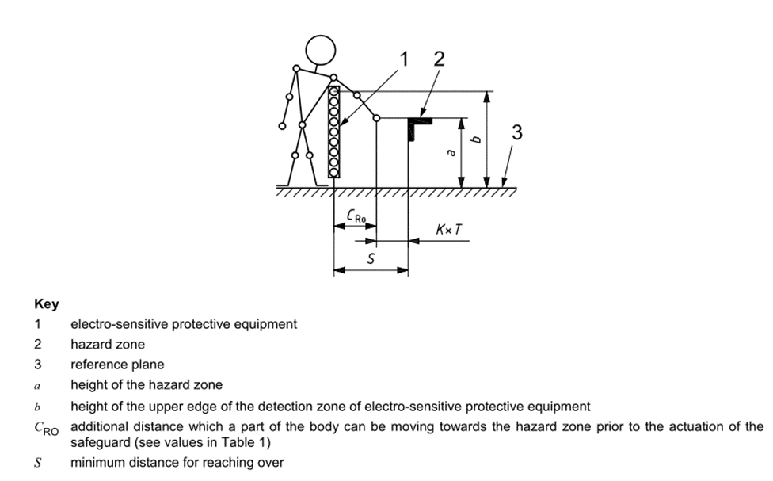

# 1.10.1. 安装安全护栏


在机器人操作期间，机器人与工人之间存在碰撞风险。因此，请安装安全护栏，以防止工人靠近机器人。


在机器人操作期间，机器人与工人之间存在碰撞风险。因此，请根据 ISO 13855:2010 安装安全护栏，以防止工人靠近机器人。当工人在机器人操作期间出于任何原因（例如检查机器人或焊接夹具、进行工具修整或更换工具等）打开安全护栏的门并靠近设备时，配置系统以确保机器人停止。

图 1.4 安全护栏的连接  

来源：ISO 13855:2010 机器安全 - 关于人体部位接近速度的保护装置定位

来源：ISO 13855:2010 机器安全 - 关于人体部位接近速度的保护装置定位

* 安全护栏应覆盖机器人的操作区域，并应确保足够的空间，以便工人在进行教学、维护等工作时没有干扰。安全护栏应坚固，以防止其轻易移动，并应构造为不允许人们通过越过安全护栏进入护栏内部。

* 原则上，要求安装和使用没有危险部分（如不平整或尖锐部分）的固定型安全护栏。

* 应安装入口门，以便人员能够进入安全护栏内部，并且必须在门上安装安全插头，使门在未移除插头时无法打开。此外，布线应配置为在移除安全插头或打开安全护栏时，电机关闭并刹车处于保持状态。

* 如果希望在安全插头移除时仍能操作机器人，则应配置布线，以允许机器人以低速运行。

* 将机器人的紧急停止按钮安装在操作员可以快速按压的位置。

* 如果不安装安全护栏，应该安装光电开关和垫开关等安全设备，覆盖在机器人的安全护栏范围规范内的整个区域，作为安全护栏的替代设备，以使机器人在人员进入安全护栏内部时能够自动停止。

* 确保机器人的操作区域（危险区域）可以通过某种方式识别，例如在地面上涂漆。