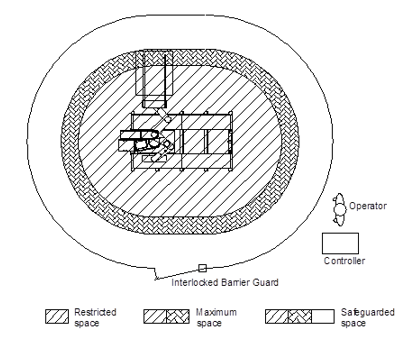
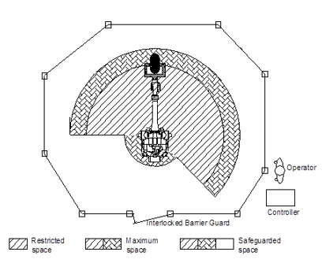

# 1.10.2. 机器人的放置及外围设备


机器人应按照 ISO 10218-2 的指导方针进行安装和操作。此外，必须遵守国际标准和国家法律的相关要求。我们公司（或制造商）将不对因未遵守国际标准和国家法律的相关要求或未审核“风险评估”而导致的任何事故承担责任。


产品的安装应由合格的安装人员根据相关国家和地方的法规及法律进行。

*	在拆箱时，请检查产品是否因运输或拆箱而受损。

*	在拆箱后安装产品之前，必须检查与产品安装和使用环境相关的安全法规、说明和信息，并充分了解安装方法。

*	在连接控制器或外围设备的主电源时，请先检查供电侧电源是否关闭，然后再进行连接。由于主电源使用高电压，存在电击风险。

*	在安全围栏的入口处张贴“操作期间禁止入内”的标志，并通知工人注意事项。

*	将控制器、联锁面板和其他控制面板放置在可以从安全围栏外操作的位置。

*	在安装操作站时，还应安装紧急停止按钮。无论您在哪里操作机器人，都应能够在紧急情况下停止机器人。

*	请勿让操纵器、控制器、联锁面板、计时器等的布线或管道被工人的脚绊倒或直接被叉车踩踏。否则，存在工人电击或电缆断开的事故风险。

*	将控制器、联锁面板和操作站放置在可以充分看到操纵器操作的地方。如果机器人在无法看到其操作的区域异常操作，或者工人在该区域工作，则在操作期间发生重大事故的风险。

*	如果所需的机器人操作区域比允许的机器人操作区域小，则应限制机器人操作区域。可以通过软限位、硬件限位、机械挡块等进行限制。即使在机器人操作出现错误等异常情况下超出正常操作区域，机器人也将通过操作区域限位功能提前停止。

*	在焊接过程中，溅出的焊渣可能会落在工人身上或附近，造成烧伤或火灾。在可以充分看到手臂移动范围的区域安装光护罩、覆盖物等。

*	对于显示机器人自动和手动操作模式的装置，应安装易于识别的装置，以确保从远处可以识别状态。在自动模式下启动操作时，蜂鸣器或报警将会很有用。

*	确保机器人的外围设备没有突出的部分。如有必要，请对其进行覆盖。否则，通常情况下，工人与突出部分接触时可能会发生事故，而工人因机器人突然移动而感到惊吓可能会摔倒，导致重大事故。

*	请勿设计需要工人把手放入安全围栏内以搬运工件的系统。

图 1.5 LCD 处理机器人的梁型安全围栏

工业机器人的外围设备和工人的放置

图 1.6 工业机器人的圆柱型安全围栏