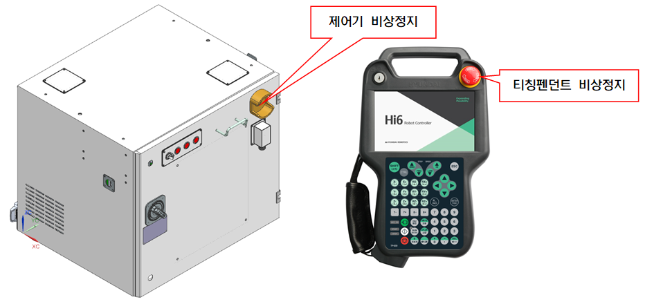

# 1.8.1. 主要安全功能

* 紧急停止（IEC 60204-1,10,7）

控制器和教学挂件上各有一个紧急停止按钮。如有必要，可以将额外的紧急按钮连接到机器人的安全链电路。紧急停止功能在所有其他控制功能之上具有更高的优先级。该功能将立即切断机器人各个轴的电源，停止机器人，并使与机器人控制的安全相关功能无法使用。 


由于紧急停止功能会立即切断电机电源，因此，鲁莽使用该功能可能导致影响机器人的耐久性的疲劳累积。该功能仅应在紧急情况下使用。


图 1.2 控制器和教学挂件上的紧急停止按钮

图 1.3 附加紧急停止装置的连接

*  保护停止（ISO 10218-1:2011）

机器人应具有多个安全输入，以便能够与安全防护、 安全垫和安全灯等外部安全设备连接。当来自机器人本身及外围设施的输入产生时，这些安全输入将使机器人停止，以确保安全状态。有关安全输入连接的详细信息，请参阅“4.3.2. 安全模块 (BD632)”。

*  速度限制（EN ISO 10218-1:2011）

在手动操作模式下，机器人的速度限制为最大250 mm/s。速度限制不仅适用于TCP（工具中心点），还适用于以手动模式操作的机器人的所有其他部件。还应能够监控安装在机器人上的设备的速度。

*  操作区域限制（ANSI/RIA R15.06-2012）

在使用机器人时，为了确保足够的安全区域，可以通过使用硬件限制或限位器来限制机器人的操作范围。如果机器人与外部安全设备（如安全防护）发生碰撞， 此功能可以最小化损害。轴1、2和3主要通过限位器或硬件限制进行限制。如果由于机械限位器或硬件限制更改了操作范围，则在软件中也应更改操作范围限制参数。有关更改的详细信息，请参阅操作手册。每个轴的操作区域限制可以由用户更改，出厂时设置为机器人的最大操作范围。 Hi6 控制器的安全系统可以选配支持最多4个硬件限位开关。有关连接事项，请参阅“4.3.2. 安全模块 (BD632)”。

*  操作模式选择（ANSI/RIA R15.06-2012）

您可以在手动、自动或远程模式下操作机器人。手动模式下的最大速度限制为250 mm/s，并且只能使用教学挂件进行操作。此外，可以通过将其配置为可选项，额外安装一个模式开关在控制面板上。有关操作的详细信息，请参阅操作手册。