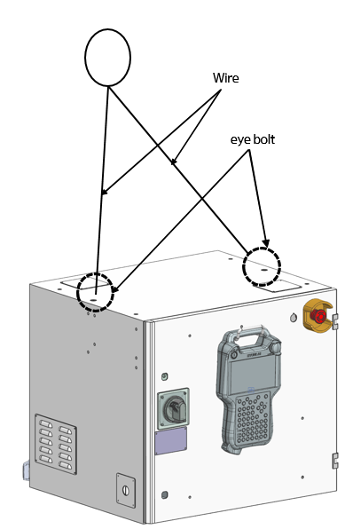

# 3.3.2. Transport (Modifying the Weight)

* 	Check whether the front door of the controller is completely locked.

*	Remove anything that is not fixed onto the controller.

*	Check if the eye bolts on the controller are surely fastened.

*	As the controller is a precision device, pay attention to the transport of it to prevent any strong impact from being applied to it.

*	The weight of the controller is maximum 200kg. When using a crane, take precautions to prevent an object on the controller from being damaged by the wire. 

※ For the weight of the controller, refer to “2. Details of Specifications’.

*	 When using a forklift, fix the controller in a way to prevent the controller from shaking.

*	When moving the product by vehicle, fix the manipulator and controller by using squids.

*	When transporting the product, fully understand the contents related to the packing and transport, and follow the instructions. Our company will not be responsible for any damage to or breaking of the product due to customer’s carelessness, inexperience in operation, or negligence.

*	Check the following items when transporting the controller by using a crane.

    - 	In general, the controller should be transported by using crane wires for which eye bolts are used.
    -	Check whether the wires have sufficient strength to withstand the weight of the controller.
    -	Check whether the eye bolts are fastened tightly.

Figure 3.3 Controller Wire Connection Position

*	Check the following items when transporting the controller by using a forklift,
    -	When transporting the product by using wire ropes, use a wire that can withstand the weight of the controller.
    -	Check whether the eyebolts are firmly fixed.
    -	Transport the controller while keeping it as low as possible.  

Figure 3.4 Transport of the Controller by Using a Forklift


If you transport the product by uisng lifting equpment, you should comply with the relevant national and local safety regulations and equipment usage guidelines. When moving the product by using a crane, you must make sure that that no workers are under the product. Also, never work or walk under the crane or the product.


