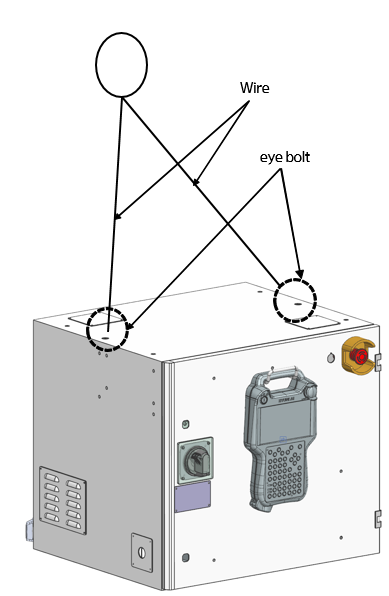

# 3.3.2. 运输 (修改重量)

* 检查控制器的前门是否完全锁定。

* 移除控制器上未固定的任何物品。

* 检查控制器上的眼螺栓是否牢固。

* 由于控制器是精密设备，注意运输时防止受到强烈冲击。

* 控制器的最大重量为200kg。使用起重机时，采取预防措施以防止控制器上的物品被钢丝损坏。

* 有关控制器的重量，请参见"2. 详细配置"。

* 使用叉车时，以防止控制器摇晃的方式固定控制器。

* 使用车辆移动产品时，使用绳索固定机械手和控制器。

* 运输产品时，充分了解与包装和运输相关的内容，并遵循说明。我们的公司对因客户疏忽、操作经验不足或粗心造成的产品损坏或破损不承担任何责任。

* 使用起重机运输控制器时，请检查以下项目。

    - 通常，控制器应使用眼螺栓所用的起重机钢丝运输。
    - 检查钢丝是否有足够的强度承受控制器的重量。
    - 检查眼螺栓是否紧固。

图 3.3 控制器线缆连接位置

* 使用叉车运输控制器时，请检查以下项目，
    - 使用钢丝绳运输产品时，使用能承受控制器重量的钢丝。
    - 检查眼螺栓是否牢固固定。
    - 运输控制器时尽可能保持低位。  

图 3.4 使用叉车运输控制器


如果您使用提升设备运输产品，您应遵守相关的国家和地方安全法规及设备使用指南。使用起重机移动产品时，必须确保没有工人在产品下方。同时，绝不要在起重机或产品下方工作或走动。
