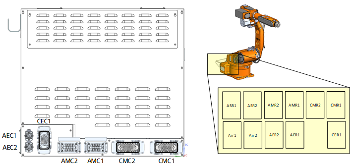

# 3.6.2. Connection of the Manipulator and Controller

Connect between the manipulator and controller by using a wire harness. Check the names of individual receptacles while connecting them.

  

Wire Harness connection diagram

<table>
<thead>
  <tr>
    <th>&nbsp;&nbsp;&nbsp; Hi6-N Controller&nbsp;&nbsp;&nbsp;</th>
    <th>&nbsp;&nbsp;&nbsp; ROBOT&nbsp;&nbsp;&nbsp;</th>
  </tr>
</thead>
<tbody>
  <tr>
    <td>&nbsp;&nbsp;&nbsp; CMC1&nbsp;&nbsp;&nbsp;</td>
    <td>&nbsp;&nbsp;&nbsp; CMR1&nbsp;&nbsp;&nbsp;</td>
  </tr>
  <tr>
    <td>&nbsp;&nbsp;&nbsp; CMC2&nbsp;&nbsp;&nbsp;</td>
    <td>&nbsp;&nbsp;&nbsp; CMR2&nbsp;&nbsp;&nbsp;</td>
  </tr>
  <tr>
    <td>&nbsp;&nbsp;&nbsp; CEC1&nbsp;&nbsp;&nbsp;</td>
    <td>&nbsp;&nbsp;&nbsp; CER1&nbsp;&nbsp;&nbsp;</td>
  </tr>
  <tr>
    <td>&nbsp;&nbsp;&nbsp; AMC1&nbsp;&nbsp;&nbsp;</td>
    <td>&nbsp;&nbsp;&nbsp; AMR1&nbsp;&nbsp;&nbsp;</td>
  </tr>
  <tr>
    <td>&nbsp;&nbsp;&nbsp; AMC2&nbsp;&nbsp;&nbsp;</td>
    <td>&nbsp;&nbsp;&nbsp; AMR2&nbsp;&nbsp;&nbsp;</td>
  </tr>
  <tr>
    <td>&nbsp;&nbsp;&nbsp; AEC1&nbsp;&nbsp;&nbsp;</td>
    <td>&nbsp;&nbsp;&nbsp; AER1&nbsp;&nbsp;&nbsp;</td>
  </tr>
  <tr>
    <td>&nbsp;&nbsp;&nbsp; AEC2&nbsp;&nbsp;&nbsp;</td>
    <td>&nbsp;&nbsp;&nbsp; AER2&nbsp;&nbsp;&nbsp;</td>
  </tr>
</tbody>
</table>


Since the contact part of the connector for each robot may be different from the figure above, you must read the relevant robot maintenance manual carefully before connecting the wire harness.


Figure 3.6 Connection of the Manipulator and Controller (Hi6-N**(U))
