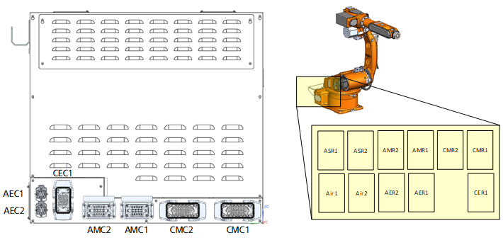

# 3.6.2. 操作器与控制器的连接

使用电缆束连接操作器和控制器。连接时检查每个插口的名称。

  

电缆束连接图

<table>
<thead>
  <tr>
    <th>&nbsp;&nbsp;&nbsp; Hi6-N 控制器&nbsp;&nbsp;&nbsp;</th>
    <th>&nbsp;&nbsp;&nbsp; 机器人&nbsp;&nbsp;&nbsp;</th>
  </tr>
</thead>
<tbody>
  <tr>
    <td>&nbsp;&nbsp;&nbsp; CMC1&nbsp;&nbsp;&nbsp;</td>
    <td>&nbsp;&nbsp;&nbsp; CMR1&nbsp;&nbsp;&nbsp;</td>
  </tr>
  <tr>
    <td>&nbsp;&nbsp;&nbsp; CMC2&nbsp;&nbsp;&nbsp;</td>
    <td>&nbsp;&nbsp;&nbsp; CMR2&nbsp;&nbsp;&nbsp;</td>
  </tr>
  <tr>
    <td>&nbsp;&nbsp;&nbsp; CEC1&nbsp;&nbsp;&nbsp;</td>
    <td>&nbsp;&nbsp;&nbsp; CER1&nbsp;&nbsp;&nbsp;</td>
  </tr>
  <tr>
    <td>&nbsp;&nbsp;&nbsp; AMC1&nbsp;&nbsp;&nbsp;</td>
    <td>&nbsp;&nbsp;&nbsp; AMR1&nbsp;&nbsp;&nbsp;</td>
  </tr>
  <tr>
    <td>&nbsp;&nbsp;&nbsp; AMC2&nbsp;&nbsp;&nbsp;</td>
    <td>&nbsp;&nbsp;&nbsp; AMR2&nbsp;&nbsp;&nbsp;</td>
  </tr>
  <tr>
    <td>&nbsp;&nbsp;&nbsp; AEC1&nbsp;&nbsp;&nbsp;</td>
    <td>&nbsp;&nbsp;&nbsp; AER1&nbsp;&nbsp;&nbsp;</td>
  </tr>
  <tr>
    <td>&nbsp;&nbsp;&nbsp; AEC2&nbsp;&nbsp;&nbsp;</td>
    <td>&nbsp;&nbsp;&nbsp; AER2&nbsp;&nbsp;&nbsp;</td>
  </tr>
</tbody>
</table>


由于每个机器人的连接器接触部分可能与上述图形不同，因此在连接电缆束之前，您必须仔细阅读相关机器人的维护手册。


图 3.6 操作器与控制器的连接 (Hi6-N**(U))