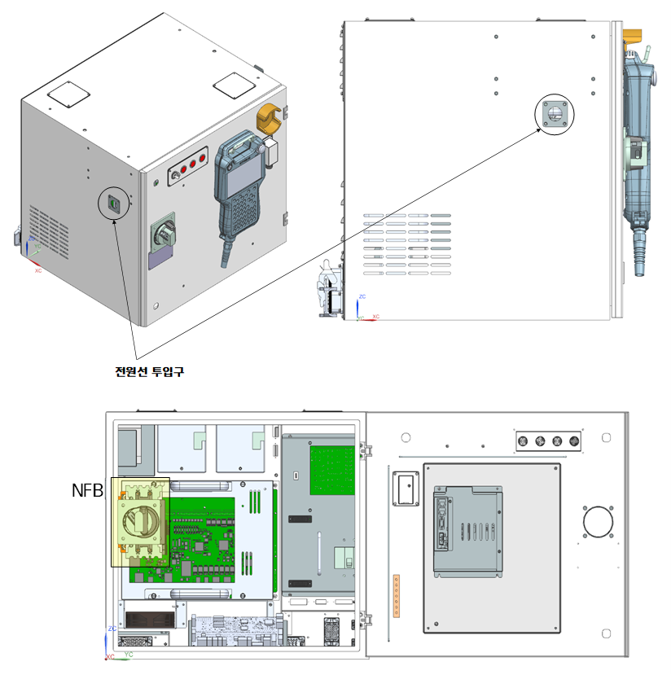
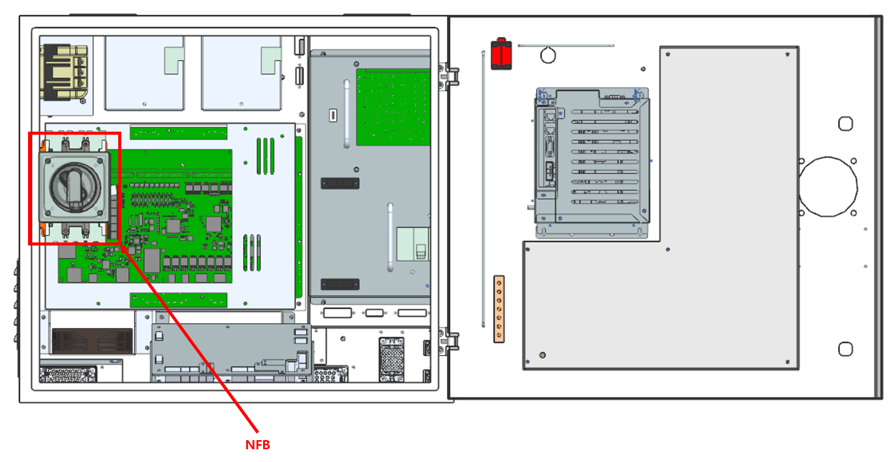

# 3.6.3. 제어기와 1차 전원의 접속

1차 전원 및 브레이커(NFB)에서 전원이 제거된 상태인지를 확인하십시오. Hi6-N\*\* 제어기는 전원 케이블을 전원 인입구로 넣어서 브레이커(NFB)에 연결하여 주십시오.

이때 1차 전원의 케이블 끝단은 적당한 크기의 터미널 단자를 사용하여 주십시오

그림 3.7 Hi6-N\*\*(U) 제어기에 1차 전원 접속부
