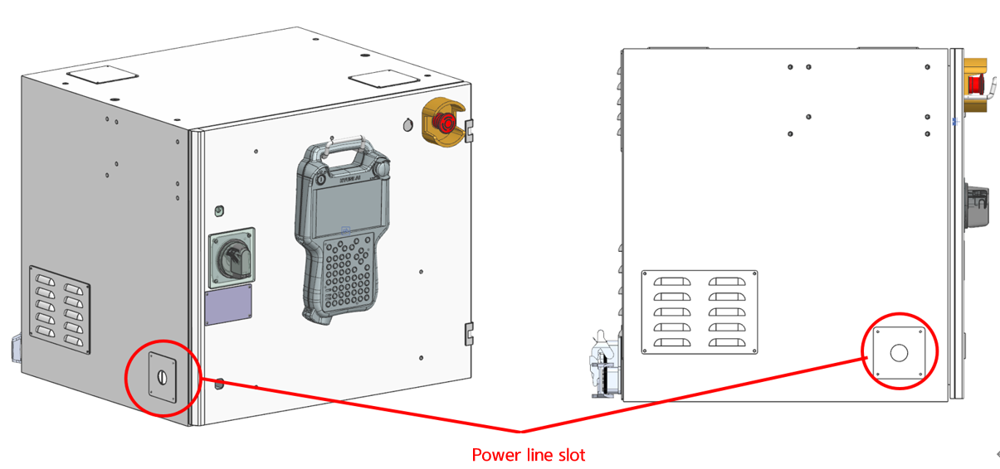

# 3.6.3. Connectin of the Controller and Primary Power

Check whether the power has been removed from the primary power and breaker (NFB).
In the case of a Hi6-N** controller, insert the power cable through the power inlet and then connect it to the breaker (NFB).

At this time, use a terminal receptable of an appropriate size for the end side of the primary power supply cable.

Figure 3.7 Primary Power Connection Part of Hi6-N**(U) Controller
