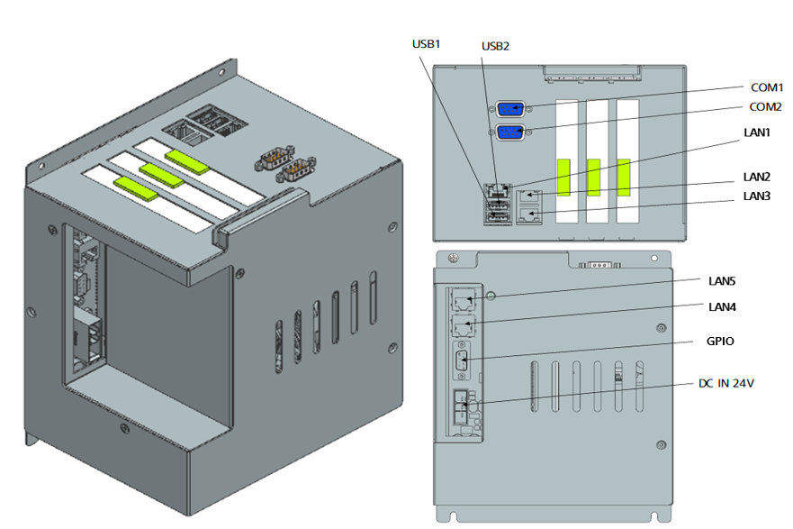

# 4.3.1.1. 概述

H6COM-T 的结构如图 4.3 所示，其中主 CPU 板和载体板相结合。主 CPU 板由 SSD 插槽、CPU 插槽、内存卡插槽、USB 端口、COM 端口和要连接到载体板的总线连接器组成。载体板包含三个用于外部系统的 LAN 端口、两个用于内部系统的 LAN 端口、两个 USB 端口、一个 GPIO 端口、两个 PCI 连接器、一个 PCI-e 连接器和一个 DC 24V 电源连接器。用于内部系统的 LAN 端口用于 EtherCAT 通信，以及与教导挂件的接口，而 GPIO 端口用于检测电源系统的电源故障信号。SB 用于调试。提供一个 PCI 扩展插槽和三个用于外部系统的备用 LAN 端口，以支持其他通用总线接口。可以通过相关插槽连接 EtherCAT 以外的其他通信接口。

图 4.6 H6COM-T