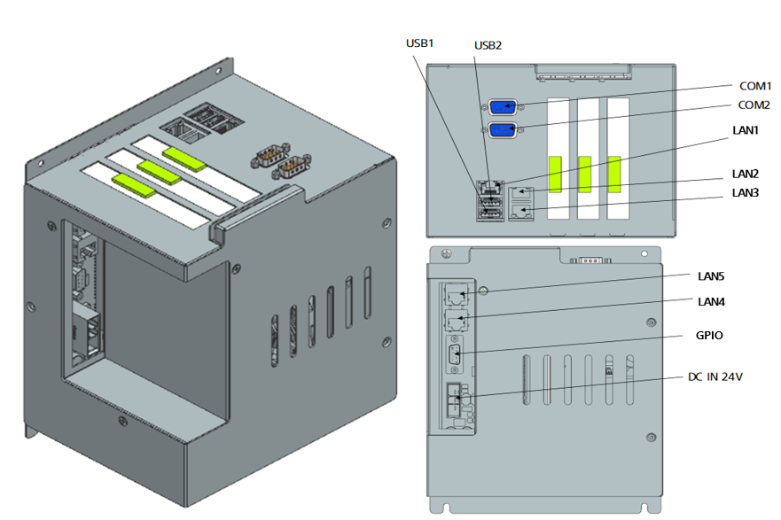

# 4.3.1.1. Overview

H6COM-T is structure as shown in Figure 4.3, in which the main CPU board and the carrier board are combined. The main CPU board consists of an SSD slot, a CPU slot, a memory card slot, a USB port, a COM port, and a bus connector that is to be connected to the carrier board. The carrier board contains three LAN ports for external systems, two LAN ports for internal systems, two USB ports, one GPIO port, two PCI connectors, one PCI-e connector and one DC 24V power connector. The LAN ports for internal systems are used for EtherCAT communication, as well as for interface with the teach pendant, and the GPIO port is used to detect a power failure signal from the power system. The SB is used for debugging. One PCI expansion slot and three spare LAN ports for external systems are provided to support other universal bus interfaces. The connection to other communication interfaces than EtherCAT can be made via the relevant slots.

Figure 4.6 H6COM-T
