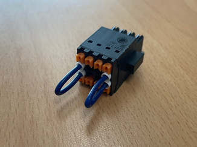

# 4.3.2.2. 连接器

下图显示了安装在BD632（安全IO模块）上的各种连接器的位置和使用方式。

의_커넥터_및_스위치_배치.png  )

图4.7 BD632（安全IO板）的连接器和开关的布置  

表4-4 BD632（安全IO板）连接器的类型和使用

<table>
<tbody>
<tr class="odd">
<td>
<strong></strong>
</td>
<td>
<strong>名称</strong>
</td>
<td>
<strong>用途</strong>
</td>
<td>
<strong>外部设备的连接</strong>
</td>
</tr>
<tr class="even">
<td>
<strong>A</strong>
</td>
<td>
<strong>CNSMPS1</strong>
</td>
<td>
SMPS DC24V电源
</td>
<td>
DC24V SMPS
</td>
</tr>
<tr class="odd">
<td>
<strong>A</strong>
</td>
<td>
<strong>CNSMPS2</strong>
</td>
<td>
SMPS DC24V电源
</td>
<td>
DC24V SMPS
</td>
</tr>
<tr class="even">
<td>
<strong>B</strong>
</td>
<td>
<strong>CNTP</strong>
</td>
<td>
紧急停止开关、模式开关和教导 pendant 的使能开关输入
</td>
<td>
教导 pendant
</td>
</tr>
<tr class="odd">
<td>
<strong>C</strong>
</td>
<td>
<strong>CNMC</strong>
</td>
<td>
磁接触（MC）输入和输出信号的连接
</td>
<td>
MC（磁接触）
</td>
</tr>
<tr class="even">
<td>
<strong>D</strong>
</td>
<td>
<strong>CNLS</strong>
</td>
<td>
检测手臂干扰和超行程的限位开关输入
</td>
<td></td>
</tr>
<tr class="odd">
<td>
<strong>E</strong>
</td>
<td>
<strong>CNLS7</strong>
</td>
<td>
检测附加轴7超行程的限位开关输入
</td>
<td></td>
</tr>
<tr class="even">
<td>
<strong>F</strong>
</td>
<td>
<strong>CNLS8</strong>
</td>
<td>
检测附加轴8超行程的限位开关输入
</td>
<td></td>
</tr>
<tr class="odd">
<td>
<strong>G</strong>
</td>
<td>
<strong>CNSV</strong>
</td>
<td>
伺服序列板（BD640） I/F

（与电动机开/关、反馈、伺服序列板和安全板相关的状态）
</td>
<td>
BD640
</td>
</tr>
<tr class="even">
<td>
<strong>H</strong>
</td>
<td>
<strong>CNEMSW</strong>
</td>
<td>
操作面板（OP）的紧急停止输入
</td>
<td>
OP（操作面板）
</td>
</tr>
<tr class="odd">
<td>
<strong>I</strong>
</td>
<td>
<strong>CNOPSW</strong>
</td>
<td>
操作面板（OP）的模式开关和按键的输入
</td>
<td>
OP（操作面板）
</td>
</tr>
<tr class="even">
<td>
<strong>J</strong>
</td>
<td>
<strong>CNOPLP</strong>
</td>
<td>
操作面板（OP）的灯输出
</td>
<td>
OP（操作面板）
</td>
</tr>
<tr class="odd">
<td>
<strong>K</strong>
</td>
<td>
<strong>TBEM</strong>
</td>
<td>
外部安全输入

（紧急停止、自动模式安全保护1、自动模式安全保护2和一般安全保护输入）
</td>
<td>
用户IO
</td>
</tr>
<tr class="even">
<td>
<strong>L</strong>
</td>
<td>
<strong>EXMON</strong>
</td>
<td>
外部电动机开启信号输入
</td>
<td></td>
</tr>
<tr class="odd">
<td>
<strong>M</strong>
</td>
<td>
<strong>TBPLC</strong>
</td>
<td>
安全PLC安全信号的连接
</td>
<td>
安全PLC
</td>
</tr>
<tr class="even">
<td>
<strong>N</strong>
</td>
<td>
<strong>MJ1</strong>
</td>
<td>
EtherCat通信连接（输入）
</td>
<td>
BD640
</td>
</tr>
<tr class="odd">
<td>
<strong>N</strong>
</td>
<td>
<strong>MJ2</strong>
</td>
<td>
EtherCat通信连接（输出）
</td>
<td>
-
</td>
</tr>
<tr class="even">
<td>
<strong>O</strong>
</td>
<td>
<strong>SW3,SW4</strong>
</td>
<td>
限位&OVT 开/关开关
</td>
<td></td>
</tr>
<tr class="odd">
<td>
<strong>P</strong>
</td>
<td>
<strong>SW1,SW2</strong>
</td>
<td>
操作面板安装输入（使能、禁用）
</td>
<td></td>
</tr>
<tr class="even">
<td>
<strong>Q</strong>
</td>
<td>
<strong>A_JTAG1,B_JTAG1</strong>
</td>
<td>
J-TAG连接器（程序下载）
</td>
<td></td>
</tr>
<tr class="odd">
<td>
<strong>R</strong>
</td>
<td>
<strong>SW7</strong>
</td>
<td>
ES, SG输入（使能、禁用）
</td>
<td></td>
</tr>
</tbody>
</table>

\(1\) BD632的外部安全信号接线端子块：TBEM

_TBEM.png  )

图4.8 BD632（安全IO板）TBEM


连接并激活与安全相关的输入时，您必须参考“1.11 操作机器人时的安全措施”检查功能是否正常运行。


表4-5 BD632（安全IO板）的TBEM说明

<table>
<thead>
  <tr>
    <th>端子号</th>
    <th>端子名称</th>
    <th>用途</th>
    <th>其他</th>
  </tr>
</thead>
<tbody>
  <tr>
    <td>16</td>
    <td>SGG1+</td>
    <td rowspan="2">一般安全防护链1输入</td>
    <td rowspan="2">如果不使用一般安全防护链1输入，应短路。</td>
  </tr>
  <tr>
    <td>8</td>
    <td>SGG1-</td>
  </tr>
  <tr>
    <td>15</td>
    <td>SGG2+</td>
    <td rowspan="2">一般安全防护链2输入</td>
    <td rowspan="2">如果不使用一般安全防护链2输入，应短路。</td>
  </tr>
  <tr>
    <td>7</td>
    <td>SGG2-</td>
  </tr>
  <tr>
    <td>14</td>
    <td>SGA11+</td>
    <td rowspan="2">自动安全防护1链1输入</td>
    <td rowspan="2">如果不使用自动安全防护1链1输入，应短路。</td>
  </tr>
  <tr>
    <td>6</td>
    <td>SGA11-</td>
  </tr>
  <tr>
    <td>13</td>
    <td>SGA21+</td>
    <td rowspan="2">自动安全防护1链2输入</td>
    <td rowspan="2">如果不使用自动安全防护1链2输入，应短路。</td>
  </tr>
  <tr>
    <td>5</td>
    <td>SGA21-</td>
  </tr>
  <tr>
    <td>12</td>
    <td>SGA12+</td>
    <td rowspan="2">自动安全防护2链1输入</td>
    <td rowspan="2">如果不使用自动安全防护2链1输入，应短路。</td>
  </tr>
  <tr>
    <td>4</td>
    <td>SGA12-</td>
  </tr>
  <tr>
    <td>11</td>
    <td>SGA22+</td>
    <td rowspan="2">自动安全防护2链2输入</td>
    <td rowspan="2">如果不使用自动安全防护2链2输入，应短路。</td>
  </tr>
  <tr>
    <td>3</td>
    <td>SGA22-</td>
  </tr>
  <tr>
    <td>10</td>
    <td>EMEX1+</td>
    <td rowspan="2">外部紧急停止链1输入</td>
    <td rowspan="2">如果不使用外部紧急停止链1，应短路。</td>
  </tr>
  <tr>
    <td>2</td>
    <td>EMEX1-</td>
  </tr>
  <tr>
    <td>9</td>
    <td>EMEX2+</td>
    <td rowspan="2">外部紧急停止链2输入</td>
    <td rowspan="2">如果不使用外部紧急停止链2，应短路。</td>
  </tr>
  <tr>
    <td>1</td>
    <td>EMEX2-</td>
  </tr>
</tbody>
</table>

\(2\) BD632的安全PLC连接接线端子块：TBPLC

_TBPLC.png  )

图4.9 BD632（安全IO板）TBPLC


连接并激活与安全相关的输入时，您必须参考“1.11 操作机器人时的安全措施”检查功能是否正常运行。


表4-6 BD632（安全IO板）的TBPLC说明

<table>
<thead>
  <tr>
    <th>端子号</th>
    <th>端子名称</th>
    <th>用途</th>
    <th>其他</th>
  </tr>
</thead>
<tbody>
  <tr>
    <td>12</td>
    <td>PLC_P</td>
    <td>安全PLC 24V</td>
    <td></td>
  </tr>
  <tr>
    <td>6</td>
    <td>PLC_G</td>
    <td>安全PLC GND</td>
    <td>用作SG/ES信号的公共接地</td>
  </tr>
  <tr>
    <td>11</td>
    <td>PLC_TO1</td>
    <td>安全IO的监测输出输入端子</td>
    <td rowspan="2">仅适用PNP输出类型</td>
  </tr>
  <tr>
    <td>5</td>
    <td>PLC_FDBK1</td>
    <td>安全IO的T0反馈信号输出</td>
  </tr>
  <tr>
    <td>10</td>
    <td>SG1</td>
    <td>来自安全PLC的安全防护输入链1</td>
    <td rowspan="2">仅适用PNP输出类型</td>
  </tr>
  <tr>
    <td>4</td>
    <td>SG2</td>
    <td>来自安全PLC的安全防护输入链2</td>
  </tr>
  <tr>
    <td>9</td>
    <td>ES1</td>
    <td>来自安全PLC的紧急停止输入链1</td>
    <td rowspan="2">仅适用PNP输出类型</td>
  </tr>
  <tr>
    <td>3</td>
    <td>ES2</td>
    <td>来自安全PLC的紧急停止输入链2</td>
  </tr>
  <tr>
    <td>8</td>
    <td>EMOUT11+</td>
    <td rowspan="2">内部紧急停止输出链1</td>
    <td rowspan="2">仅适用PNP输出类型</td>
  </tr>
  <tr>
    <td>2</td>
    <td>EMOUT11-</td>
  </tr>
  <tr>
    <td>7</td>
    <td>EMOUT21+</td>
    <td rowspan="2">内部紧急停止输出链2</td>
    <td rowspan="2">仅适用PNP输出类型</td>
  </tr>
  <tr>
    <td>1</td>
    <td>EMOUT21-</td>
  </tr>
</tbody>
</table>

\(3\) 外部电动机开启连接器

表4-7 BD632外部电动机开启开关

<table>
<tbody>
<tr class="odd">
<td>
<strong>端子号 </strong>
</td>
<td>
<strong>端子名称</strong>
</td>
<td>
<strong>用途</strong>
</td>
<td>
<strong>其他</strong>
</td>
</tr>
<tr class="even">
<td>
5
</td>
<td>
EXMON_C1+
</td>
<td>
外部电动机开启（接触型）
</td>
<td>
不使用时，应将EXMON_C1+与EXMON_C1-短路。
</td>
</tr>
<tr class="odd">
<td>
1
</td>
<td>
EXMON_C1-
</td>
<td>
外部电动机开启（接触型）
</td>
<td>
不使用时，应将EXMON_C1+与EXMON_C1-短路。
</td>
</tr>
<tr class="even">
<td>
8
</td>
<td>
EXMON_C2+
</td>
<td>
外部电动机开启（接触型）
</td>
<td>
不使用时，应将EXMON_C2+与EXMON_C2-短路。
</td>
</tr>
<tr class="odd">
<td>
4
</td>
<td>
EXMON_C2-
</td>
<td>
外部电动机开启（接触型）
</td>
<td>
不使用时，应将EXMON_C2+与EXMON_C2-短路。
</td>
</tr>
</tbody>
</table>