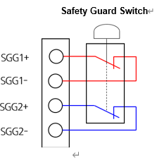
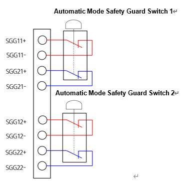

# 4.3.2.6. 安全保护装置的连接

(1\) 一般安全保护装置

一般安全保护装置在控制器的模式（自动或手动）下均可操作。换句话说，当人进入安装的安全保护装置内部或保护装置被破坏时，控制器将立即切断电机电源。可使用的安全保护装置应该是接触输出的形式。在终端块 TBEM 中，端子被配置为将安全保护装置的接触输出连接到双重安全链，如下图所示。

图 4.14 将一般安全保护装置连接到终端块 TBRMT 的方法

如果不使用一般安全保护装置，请将终端块 TBEM 的端子（引脚 15-7 和 16-8）连接，如下所示，以禁用输入。

_TBEM.png)

图 4.15 不使用一般安全保护装置时的操作方法


如果要安装和使用一般安全保护装置，则在操作机器人之前应确认急停按钮正常运行。此外，检查急停输入是否被禁用。这是确保工人安全的必要措施。


(2\) 接触输入类型的自动安全保护装置

仅当控制器处于自动模式时，自动安全保护装置才会工作，并提供两个输入，如下所示。与一般安全保护装置一样，自动安全保护装置也应为接触输出的形式。在终端块 TBEM 中，端子被配置为将安全保护装置的接触输出连接到双重安全链，如下图所示。

图 4.16 将接触输入类型的自动安全保护装置连接到终端块 TBEM 的方法

如果不使用自动安全保护装置，请将终端块 TBEM 的端子（引脚 11-3、12-4、13-5 和 14-6）连接，如下所示，以禁用输入。

_TBEM.png)

图 4.17 不使用接触输入类型的自动安全保护装置时的操作方法


如果要安装和使用自动安全保护装置，则在操作机器人之前应确认急停按钮正常运行。此外，检查急停输入是否被禁用。这是确保工人安全的必要措施。
