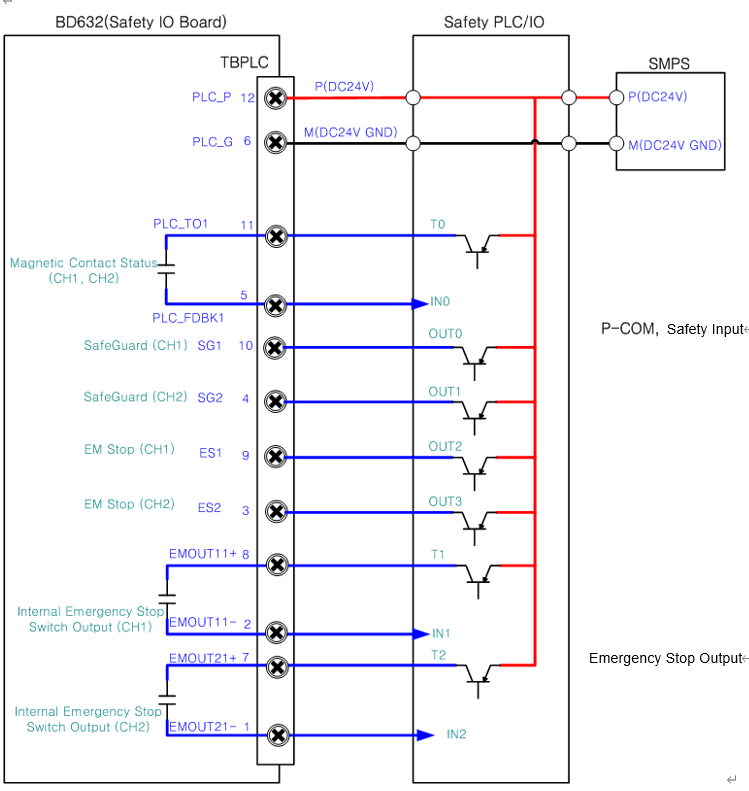

# 4.3.2.7. 安全PLC/IO的连接

安全PLC或IO与机器人控制器之间的紧急输入信号和监控输出信号应该按照以下方式连接。

图4.18 连接安全PLC/IO的方法

\(1\) P-COM输入和安全输入 

安全PLC的安全输入（ES，SG）设计成可以从端子块TBEM接收PNP输出作为输入。考虑到这一点，在使用安全输入之前，必须连接PLC的电源（DC24V）。


如果要安装和使用安全输入，则应在确认功能正常工作后操作机器人。这是为工人安全必须提前采取的必要措施。


\(2\) 紧急停止输出

紧急停止输出的设计方式允许控制器在需要外部设备使用控制器内部安装的紧急停止开关（在操作面板、教导盒等上）的状态时开启或关闭PNP输出。


如果要安装和使用紧急停止输出，则应在确认紧急停止输出正常运行后操作机器人。这是为工人安全必须提前采取的必要措施。
