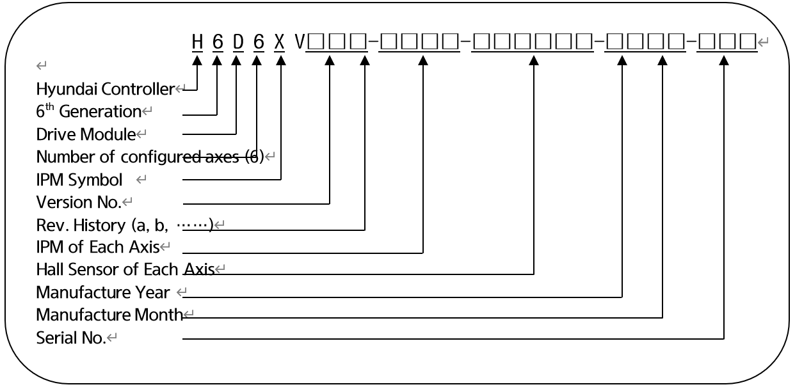
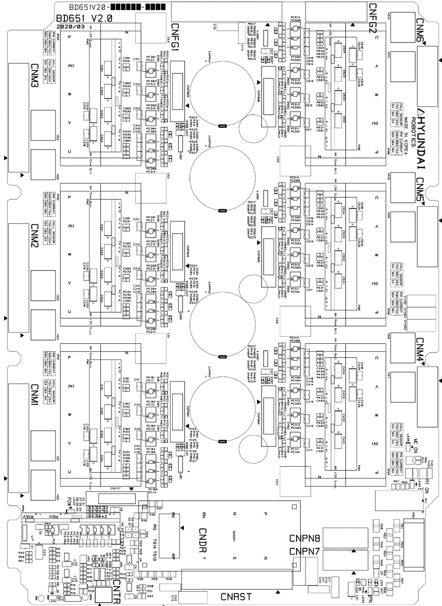

# 4.3.4.1. H6D6X (중형 6축 일체형 드라이브모듈)

드라이브모듈(Drive Module)은 서보보드로부터의 전류지령에 따라 모터 각상에 전류를 흘려주는 전력증폭기능을 수행합니다. 6축 일체형 드라이브모듈은 6개의 모터를 동시에 구동시킬 수 있으며, 다음과 같이 구성되어 있습니다.

전원공급모듈로부터 입력되는 3상 전류를 다이오드모듈로 정류 후 직류로 변화하여 평활용 커패시터에 저장합니다. 로봇의 감속 시에 모터로부터 발생하는 전력은 IGBT와 저항을 통하여 소비하며, 다음과 같이 구성되어 있습니다

표 4-14 H6D6X(중형 6축 일체형 드라이브모듈)의 구성

<table>
<thead>
  <tr>
    <th colspan="2">구성품</th>
    <th>기능</th>
  </tr>
</thead>
<tbody>
  <tr>
    <td rowspan="6">BD651 (Power Board)</td>
    <td>게이트 드라이브 회로</td>
    <td>IPM 게이트 신호 생성</td>
  </tr>
  <tr>
    <td>게이트 전원 모듈</td>
    <td>게이트 전원 전달</td>
  </tr>
  <tr>
    <td>전류 검출부</td>
    <td>모터에 흐르는 전류를 검출</td>
  </tr>
  <tr>
    <td>회생 제어</td>
    <td>PN전압의 상승 시 IGBT 구동</td>
  </tr>
  <tr>
    <td>에러검출부</td>
    <td>PN 과전압, 회생방전 저항 과열, PN 저전압 에러 검지</td>
  </tr>
  <tr>
    <td>고전압 커패시터</td>
    <td>직류 전원 평활</td>
  </tr>
  <tr>
    <td rowspan="2">BD652 (Interface Board)</td>
    <td>시퀀스 연동부</td>
    <td>시퀀스 상태와 서보 온 신호 연동</td>
  </tr>
  <tr>
    <td>전용 IO 터미널블록</td>
    <td>제어기 내부의 예비 IO 포트</td>
  </tr>
  <tr>
    <td rowspan="4">기타부품</td>
    <td>방열판(Heat Sink)</td>
    <td>전력소자로부터 발생하는 열을 외부로 방출</td>
  </tr>
  <tr>
    <td>정류부</td>
    <td>교류입력 전원을 정류하여 모터 구동용 직류 전원 생성</td>
  </tr>
  <tr>
    <td>회생 IGBT</td>
    <td>회생방전 수행</td>
  </tr>
  <tr>
    <td>IPM</td>
    <td>3상 모터 구동용 전력 변환</td>
  </tr>
</tbody>
</table>

■  **중형 6축 일체형 드라이브모듈 형번 구성**

표 4-15 중형 6축 일체형 드라이브모듈의 형식기호

<table>
<tbody>
<tr class="odd">
<td>
<strong>구분</strong>
</td>
<td>
<strong>형식기호</strong>
</td>
</tr>
<tr class="even">
<td>
<strong>Hi6 중형 6축 드라이브모듈</strong>
</td>
<td>
H6D6X
</td>
</tr>
</tbody>
</table>

표 4-16 중형 6축 일체형 드라이브모듈의 사양

<table>
<thead>
  <tr>
    <th>구성</th>
    <th colspan="2">분류</th>
    <th colspan="2">적용</th>
  </tr>
</thead>
<tbody>
  <tr>
    <td rowspan="2">IPM용량</td>
    <td>3X</td>
    <td>3Y</td>
    <td>HS180, HS220, HH300, HH050</td>
    <td rowspan="2">6축 일체형</td>
  </tr>
  <tr>
    <td>4X</td>
    <td>2Y</td>
    <td>HC2502B2D, HC2503B2D</td>
  </tr>
  <tr>
    <td>년도</td>
    <td colspan="2">00 ~ 99</td>
    <td colspan="2">생산년도: 2000년 ~ 2099년</td>
  </tr>
  <tr>
    <td>월</td>
    <td colspan="2">01 ~ 12</td>
    <td colspan="2">생산월: 1월 ~ 12월</td>
  </tr>
  <tr>
    <td>일련번호</td>
    <td colspan="2">001 ~ 999</td>
    <td colspan="2">월 생산대수: 1대 ~ 999대</td>
  </tr>
</tbody>
</table>

표 4-17 중형 6축 드라이브모듈의 IPM 기호

<table>
<thead>
  <tr>
    <th>Drive Model</th>
    <th>IPM 기호</th>
    <th>IPM 사양</th>
  </tr>
</thead>
<tbody>
  <tr>
    <td rowspan="3">중형 6축 드라이브 모듈
</td>
    <td>X</td>
    <td>(IPM 전류정격) 100A</td>
  </tr>
  <tr>
    <td>Y</td>
    <td>(IPM 전류정격) 75A</td>
    <td rowspan="5">
  </tr>
  <tr>
    <td>Z</td>
    <td>(IPM 전류정격) 50A</td>
  </tr>
</tbody>
</table>

표 4-18 중형 6축 드라이브모듈의 홀센서(Hall Sensor) 기호

<table>
<thead>
  <tr>
    <th>Drive Model</th>
    <th>Hall Sensor기호(사양)</th>
    <th>Full Scale 전류(Im)</th>
    <th>IPM 사양 (정격 전류)</th>
  </tr>
</thead>
<tbody>
  <tr>
    <td rowspan="6">중형 6축 드라이브 모듈
</td>
    <tr>
    <td>1 (4V/50A)</td>
    <td>93.75Apeak</td>
    <td rowspan="5">PM100CG1APL065 202G (100A) PM75CG1APL065 202G (75A) PM50CG1APL065 202G (50A)</td>
  </tr>
  <tr>
    <td>2 (4V/25A)</td>
    <td>46.87Apeak</td>
  </tr>
  <tr>
    <td>3 (4V/15A)</td>
    <td>28.12Apeak</td>
  </tr>
  <tr>
    <td>4 (4V/10A)</td>
    <td>18.75Apeak</td>
  </tr>
  <tr>
    <td>5 (4V/ 5A)</td>
    <td>9.37Apeak</td>
  </tr>
</tbody>
</table>


드라이브 모듈은 로봇에 따라 다르므로 교환할 때에는 형식을 반드시 확인하시기 바랍니다.


그림 4.20 BD651 부품 배치도

표 4-19 BD651 커넥터 설명

<table>
<tbody>
<tr class="odd">
<td>
<strong>명칭</strong>
</td>
<td>
<strong>용도</strong>
</td>
<td>
<strong>외부장치접속</strong>
</td>
</tr>
<tr class="even">
<td>
<strong>CNPWM1~6</strong>
</td>
<td>
PWM신호, IPM에러 신호
</td>
<td>
BD652 Board to Board 커넥터
</td>
</tr>
<tr class="odd">
<td>
<strong>CNRST</strong>
</td>
<td>
3상 전원 입력
</td>
<td>
전장 모듈 CNRST
</td>
</tr>
<tr class="even">
<td>
<strong>CNCVT</strong>
</td>
<td>
컨버터부 에러 신호
</td>
<td>
BD652 Board to Board 커넥터
</td>
</tr>
<tr class="odd">
<td>
<strong>CNDR</strong>
</td>
<td>
회생방전 전력 출력
</td>
<td>
회생방전 저항
</td>
</tr>
<tr class="even">
<td>
<strong>CNTR</strong>
</td>
<td>
회생방전 저항 과열 검지
</td>
<td>
회생방전 저항 온도센서
</td>
</tr>
<tr class="odd">
<td>
<strong>CNM1~3</strong>
</td>
<td>
1축~3축 모터 구동 출력
</td>
<td>
CMC1
</td>
</tr>
<tr class="even">
<td>
<strong>CNM4~6</strong>
</td>
<td>
4축~6축 모터 구동 출력
</td>
<td>
CMC2
</td>
</tr>
<tr class="odd">
<td>
<strong>CNPN7~8</strong>
</td>
<td>
부가축 드라이브모듈 직류전원
</td>
<td>
선택사양 부가축 드라이브모듈 CNPN
</td>
</tr>
<tr class="even">
<td>
<strong>CNFG1</strong>
</td>
<td>
1축~3축 모터의 Frame Ground
</td>
<td>
CMC1
</td>
</tr>
<tr class="odd">
<td>
<strong>CNFG2</strong>
</td>
<td>
4축~6축 모터의 Frame Ground
</td>
<td>
CMC2
</td>
</tr>
</tbody>
</table>

표 4-20 BD651 LED 설명

<table>
<tbody>
<tr class="odd">
<td>
<strong>명칭</strong>
</td>
<td>
<strong>색상</strong>
</td>
<td>
<strong>상태 표시</strong>
</td>
</tr>
<tr class="even">
<td>
<strong>MC ON</strong>
</td>
<td>
황색
</td>
<td>
전자접촉기 구동 시 점등
</td>
</tr>
<tr class="odd">
<td>
<strong>POW</strong>
</td>
<td>
녹색
</td>
<td>
컨버터부 제어전압 정상 시 점등
</td>
</tr>
<tr class="even">
<td>
<strong>DR</strong>
</td>
<td>
적색
</td>
<td>
회생방전 동작 시 점등
</td>
</tr>
<tr class="odd">
<td>
<strong>PN</strong>
</td>
<td>
적색
</td>
<td>
PN전압이 42V이상 시 점등
</td>
</tr>
<tr class="even">
<td>
<strong>RYON</strong>
</td>
<td>
적색
</td>
<td>
PN방전 동작 시 소등
</td>
</tr>
</tbody>
</table>

그림 4.21 BD652 부품 배치도

표 4-21 BD652 커넥터 설명

<table>
<tbody>
<tr class="odd">
<td>
<strong>명칭</strong>
</td>
<td>
<strong>용도</strong>
</td>
<td>
<strong>외부장치접속</strong>
</td>
</tr>
<tr class="even">
<td>
<strong>CNBS1~3</strong>
</td>
<td>
8축 PWM신호, IPM에러 신호 컨버터부 에러 신호
</td>
<td>
BD640 Board to Board 커넥터
</td>
</tr>
<tr class="odd">
<td>
<strong>CNPWM1~6</strong>
</td>
<td>
축별 PWM신호, IPM에러 신호
</td>
<td>
BD651 Board to Board 커넥터
</td>
</tr>
<tr class="even">
<td>
<strong>CNPWM7~8</strong>
</td>
<td>
부가축 PWM신호, IPM에러 신호
</td>
<td>
부가축 드라이브모듈(BD658 또는 BD659)의 CNPWM
</td>
</tr>
<tr class="odd">
<td>
<strong>CNCVT</strong>
</td>
<td>
컨버터부 에러 신호
</td>
<td>
BD651 Board to Board 커넥터
</td>
</tr>
<tr class="even">
<td>
<strong>TBIO</strong>
</td>
<td>
예비 전용IO 터미널블록
</td>
<td>
Reserved
</td>
</tr>
</tbody>
</table>

표 4-22 BD652 LED 설명

<table>
<tbody>
<tr class="odd">
<td>
<strong>명칭</strong>
</td>
<td>
<strong>색상</strong>
</td>
<td>
<strong>상태 표시</strong>
</td>
</tr>
<tr class="even">
<td>
<strong>MC</strong>
</td>
<td>
황색
</td>
<td>
전자접촉기 구동 시 점등
</td>
</tr>
<tr class="odd">
<td>
<strong>POW</strong>
</td>
<td>
녹색
</td>
<td>
제어전원 정상 시 점등
</td>
</tr>
</tbody>
</table>
