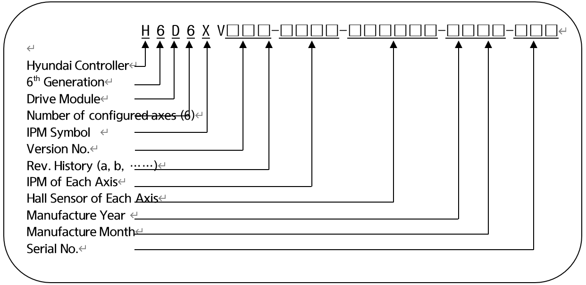
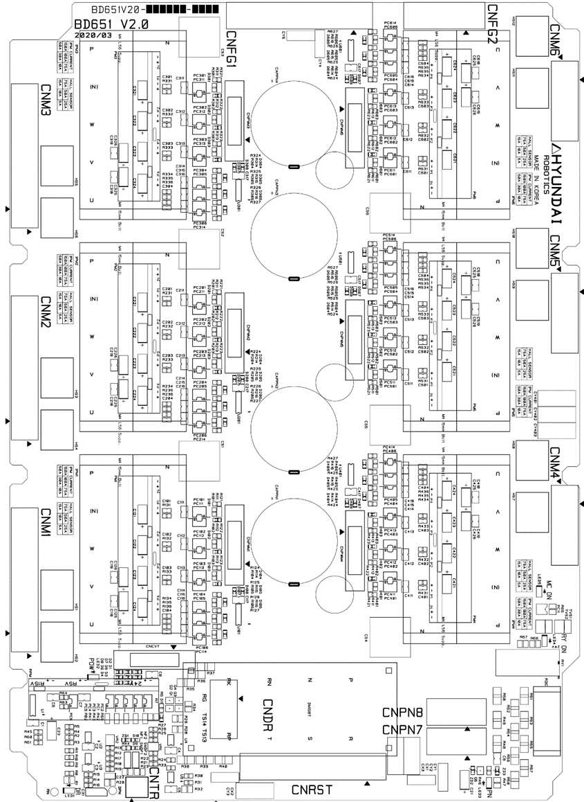
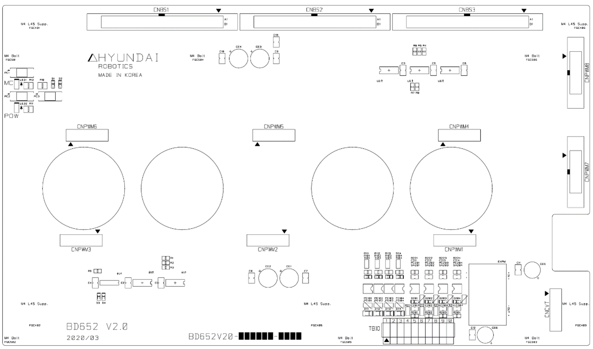

# 4.3.4.1. H6D6X (中型6轴一体化驱动模块)

驱动模块执行功率放大功能，允许电流根据伺服板的当前命令流向电机的各个相。六轴一体化驱动模块可以同时驱动六个电机，配置如下。

从电源模块输入的三相电流通过二极管模块整流，然后转换为直流电并存储在平滑电容中。当机器人的电机速度减速时，电机产生的电力将通过IGBT和电阻消耗。相关配置如下。

表4-14 H6D6X（中型6轴一体化驱动模块）的配置

<table>
<thead>
  <tr>
    <th colspan="2">组件</th>
    <th>功能</th>
  </tr>
</thead>
<tbody>
  <tr>
    <td rowspan="6">BD651 (电源板)</td>
    <td>栅极驱动电路</td>
    <td>生成IPM栅极信号</td>
  </tr>
  <tr>
    <td>栅极电源模块</td>
    <td>传输栅极电源</td>
  </tr>
  <tr>
    <td>电流检测部分</td>
    <td>检测通过电机的电流</td>
  </tr>
  <tr>
    <td>再生控制</td>
    <td>当PN电压上升时驱动IGBT</td>
  </tr>
  <tr>
    <td>错误检测部分</td>
    <td>检测PN过电压、再生放电电阻过热和PN欠电压错误</td>
  </tr>
  <tr>
    <td>高压电容</td>
    <td>平滑直流电</td>
  </tr>
  <tr>
    <td rowspan="2">BD652 (接口板)</td>
    <td>顺序联锁部分</td>
    <td>在顺序状态和伺服开启信号之间进行联锁</td>
  </tr>
  <tr>
    <td>专用IO端子块</td>
    <td>控制器内部保留的IO端口</td>
  </tr>
  <tr>
    <td rowspan="4">其他部分</td>
    <td>散热器</td>
    <td>将功率元件产生的热量释放到外部</td>
  </tr>
  <tr>
    <td>整流部分</td>
    <td>整流交流输入功率以产生驱动电机的直流电</td>
  </tr>
  <tr>
    <td>再生IGBT</td>
    <td>执行再生放电</td>
  </tr>
  <tr>
    <td>IPM</td>
    <td>转换驱动三相电动机的功率</td>
  </tr>
</tbody>
</table>

■  **中型6轴一体化驱动模块的型号配置**

表4-15 中型6轴一体化驱动模块的类型符号 

<table>
<tbody>
<tr class="odd">
<td>
<strong>类别</strong>
</td>
<td>
<strong>型号符号</strong>
</td>
</tr>
<tr class="even">
<td>
<strong>Hi6 中型6轴驱动模块</strong>
</td>
<td>
H6D6X
</td>
</tr>
</tbody>
</table>

表4-16 中型6轴一体化驱动模块的规格

<table>
<thead>
  <tr>
    <th>配置</th>
    <th colspan="2">分类</th>
    <th colspan="2">应用</th>
  </tr>
</thead>
<tbody>
  <tr>
    <td rowspan="2">IPM容量</td>
    <td>3X</td>
    <td>3Y</td>
    <td>HS180, HS220, HH300, HH050</td>
    <td rowspan="2">6轴一体化</td>
  </tr>
  <tr>
    <td>4X</td>
    <td>2Y</td>
    <td>HC2502B2D, HC2503B2D</td>
  </tr>
  <tr>
    <td>年份</td>
    <td colspan="2">00 ~ 99</td>
    <td colspan="2">生产年份：2000~2099</td>
  </tr>
  <tr>
    <td>月份</td>
    <td colspan="2">01 ~ 12</td>
    <td colspan="2">生产月份：一月至十二月</td>
  </tr>
  <tr>
    <td>序列号</td>
    <td colspan="2">001 ~ 999</td>
    <td colspan="2">每月生产的单位数量：1~999</td>
  </tr>
</tbody>
</table>

表4-17 中型6轴驱动模块的IPM符号 

<table>
<thead>
  <tr>
    <th>驱动模型</th>
    <th>IPM符号</th>
    <th>IPM规格</th>
  </tr>
</thead>
<tbody>
  <tr>
    <td rowspan="6">中型6轴驱动模块</td>
    <td>X</td>
    <td>(IPM电流额定值) 100A</td>
  </tr>
  <tr>
    <td>Y</td>
    <td>(IPM电流额定值) 75A</td>
  </tr>
   <tr>
    <td>Z</td>
    <td>(IPM电流额定值) 50A</td>
  </tr>
</tbody>
</table>

表4-18 中型6轴驱动模块的霍尔传感器符号 

<table>
<thead>
  <tr>
    <th>驱动模型</th>
    <th>霍尔传感器符号（规格）</th>
    <th>满刻度电流（Im）</th>
    <th>IPM规格 (额定电流)</th>
  </tr>
</thead>
<tbody>
  <tr>
    <td rowspan="6">中型6轴驱动模块</td>
  </tr>
  <tr>
    <td>1 (4V/50A)</td>
    <td>93.75Apeak</td>
    <td rowspan="5">PM100CG1APL065 202G (100A) PM75CG1APL065 202G (75A) PM50CG1APL065 202G (50A)</td>
  </tr>
  <tr>
    <td>2 (4V/25A)</td>
    <td>46.87Apeak</td>
  </tr>
  <tr>
    <td>3 (4V/15A)</td>
    <td>28.12Apeak</td>
  </tr>
  <tr>
    <td>4 (4V/10A)</td>
    <td>18.75Apeak</td>
  </tr>
  <tr>
    <td>5 (4V/ 5A)</td>
    <td>9.37Apeak</td>
  </tr>
</tbody>
</table>


驱动模块因机器人类型的不同而有所不同，因此更换时必须检查类型。


图 4.20 BD651的零件布局示意图  

表4-19 BD651的连接器说明

<table>
<tbody>
<tr class="odd">
<td>
<strong>名称</strong>
</td>
<td>
<strong>用途</strong>
</td>
<td>
<strong>外部设备连接</strong>
</td>
</tr>
<tr class="even">
<td>
<strong>CNPWM1~6</strong>
</td>
<td>
PWM信号和IPM错误信号
</td>
<td>
BD652的板对板连接器
</td>
</tr>
<tr class="odd">
<td>
<strong>CNRST</strong>
</td>
<td>
三相电源输入
</td>
<td>
电子模块的CNRST
</td>
</tr>
<tr class="even">
<td>
<strong>CNCVT</strong>
</td>
<td>
变换器部分错误信号
</td>
<td>
BD652的板对板连接器
</td>
</tr>
<tr class="odd">
<td>
<strong>CNDR</strong>
</td>
<td>
再生放电功率输出
</td>
<td>
再生放电电阻
</td>
</tr>
<tr class="even">
<td>
<strong>CNTR</strong>
</td>
<td>
再生放电电阻过热检测
</td>
<td>
再生放电电阻温度传感器
</td>
</tr>
<tr class="odd">
<td>
<strong>CNM1~3</strong>
</td>
<td>
轴1到轴3的电机驱动输出
</td>
<td>
CMC1
</td>
</tr>
<tr class="even">
<td>
<strong>CNM4~6</strong>
</td>
<td>
轴4到轴6的电机驱动输出
</td>
<td>
CMC2
</td>
</tr>
<tr class="odd">
<td>
<strong>CNPN7~8</strong>
</td>
<td>
额外轴的驱动模块的直流电源
</td>
<td>
可选额外轴驱动模块的CNPN。
</td>
</tr>
<tr class="even">
<td>
<strong>CNFG1</strong>
</td>
<td>
轴1到轴3的框架接地
</td>
<td>
CMC1
</td>
</tr>
<tr class="odd">
<td>
<strong>CNFG2</strong>
</td>
<td>
轴4到轴6的框架接地
</td>
<td>
CMC2
</td>
</tr>
</tbody>
</table>

表4-20 BD651的LED说明

<table>
<tbody>
<tr class="odd">
<td>
<strong>名称</strong>
</td>
<td>
<strong>颜色</strong>
</td>
<td>
<strong>状态显示</strong>
</td>
</tr>
<tr class="even">
<td>
<strong>MC ON</strong>
</td>
<td>
黄色
</td>
<td>
当磁接触驱动时点亮
</td>
</tr>
<tr class="odd">
<td>
<strong>POW</strong>
</td>
<td>
绿色
</td>
<td>
当变换器部分的控制电压正常时点亮
</td>
</tr>
<tr class="even">
<td>
<strong>DR</strong>
</td>
<td>
红色
</td>
<td>
当再生放电正在操作时点亮
</td>
</tr>
<tr class="odd">
<td>
<strong>PN</strong>
</td>
<td>
红色
</td>
<td>
当PN电压高于42V时点亮
</td>
</tr>
<tr class="even">
<td>
<strong>RYON</strong>
</td>
<td>
红色
</td>
<td>
当PN放电操作时熄灭
</td>
</tr>
</tbody>
</table>

图 4.21 BD652的零件布局示意图

表4-21 BD652的连接器说明

<table>
<tbody>
<tr class="odd">
<td>
<strong>名称</strong>
</td>
<td>
<strong>用途</strong>
</td>
<td>
<strong>外部设备连接</strong>
</td>
</tr>
<tr class="even">
<td>
<strong>CNBS1~3</strong>
</td>
<td>
8轴的PWM信号和IPM错误信号 变换器部分错误信号
</td>
<td>
BD640的板对板连接器
</td>
</tr>
<tr class="odd">
<td>
<strong>CNPWM1~6</strong>
</td>
<td>
个体轴的PWM信号和IPM错误信号
</td>
<td>
BD651的板对板连接器
</td>
</tr>
<tr class="even">
<td>
<strong>CNPWM7~8</strong>
</td>
<td>
额外轴的PWM信号和IPM错误信号
</td>
<td>
额外轴的驱动模块（BD658或BD659）的CNPWM
</td>
</tr>
<tr class="odd">
<td>
<strong>CNCVT</strong>
</td>
<td>
变换器部分错误信号
</td>
<td>
BD651的板对板连接器
</td>
</tr>
<tr class="even">
<td>
<strong>TBIO</strong>
</td>
<td>
仅保留用于IO端子块
</td>
<td>
保留
</td>
</tr>
</tbody>
</table>

表4-22 BD652的LED说明

<table>
<tbody>
<tr class="odd">
<td>
<strong>名称</strong>
</td>
<td>
<strong>颜色</strong>
</td>
<td>
<strong>状态显示</strong>
</td>
</tr>
<tr class="even">
<td>
<strong>MC</strong>
</td>
<td>
黄色
</td>
<td>
当磁接触驱动时点亮
</td>
</tr>
<tr class="odd">
<td>
<strong>POW</strong>
</td>
<td>
绿色
</td>
<td>
当控制电源正常时点亮
</td>
</tr>
</tbody>
</table>