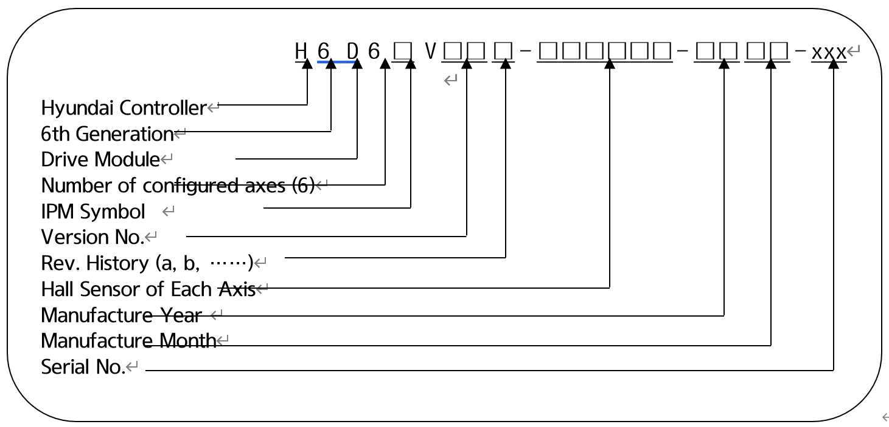
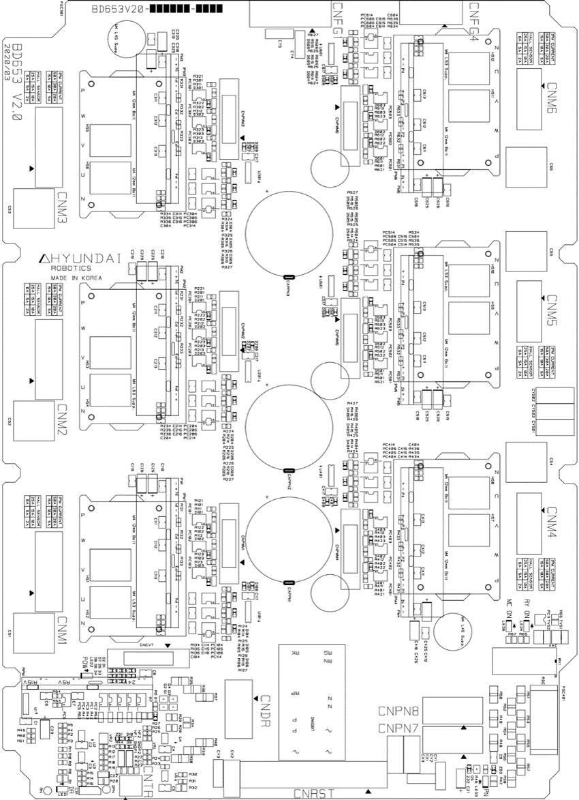
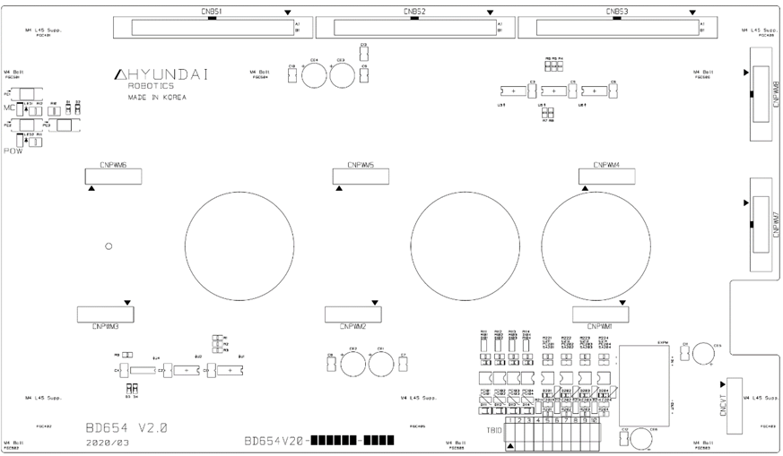

# 4.3.4.2. H6D6A (小型六轴集成驱动模块)

该驱动模块执行功率放大功能，使电流能够按照伺服板发出的电流命令流向电机的各个相。六轴集成驱动模块可以同时驱动六台电机，配置如下。

从电源模块输入的三相电流通过二极管模块整流后，转变为直流电并储存在平滑电容器中。当机械人的电机速度减速时，由电机产生的电能将通过IGBT和电阻消耗。相关配置如下。

表 4-23 H6D6A (小型六轴集成驱动模块) 的配置

<table>
<thead>
  <tr>
    <th colspan="2">组件</th>
    <th>组件</th>
  </tr>
</thead>
<tbody>
  <tr>
    <td rowspan="6">BD653 (电源板)</td>
    <td>门驱动电路</td>
    <td>产生IPM门信号</td>
  </tr>
  <tr>
    <td>门电源模块</td>
    <td>产生门电源</td>
  </tr>
  <tr>
    <td>电流检测部分</td>
    <td>检测流经电机的电流</td>
  </tr>
  <tr>
    <td>再生控制</td>
    <td>当PN电压上升时打开IGBT</td>
  </tr>
  <tr>
    <td>错误检测部分</td>
    <td>检测过压、再生电阻过热和欠压错误</td>
  </tr>
  <tr>
    <td>高压电容</td>
    <td>平滑直流电</td>
  </tr>
  <tr>
    <td rowspan="2">BD654 (接口板)</td>
    <td>顺序联锁部分</td>
    <td>在顺序状态和伺服启信号之间联锁</td>
  </tr>
  <tr>
    <td>专用IO接线端子</td>
    <td>控制器内部的保留IO端口</td>
  </tr>
  <tr>
    <td rowspan="4">其他部件</td>
    <td>散热器</td>
    <td>将电源元件产生的热量释放到外部</td>
  </tr>
  <tr>
    <td>整流部分</td>
    <td>将交流输入电源整流生成直流电源以驱动电机</td>
  </tr>
  <tr>
    <td>再生IGBT</td>
    <td>执行再生放电</td>
  </tr>
  <tr>
    <td>IPM</td>
    <td>转变为驱动三相电机的电源</td>
  </tr>
</tbody>
</table>


驱动模块因机械人类型不同而有所不同，因此更换时必须确认类型。


■  **小型六轴集成驱动模块的型号配置**

表 4-24 小型六轴集成驱动模块的类型符号

<table>
<tbody>
<tr class="odd">
<td>
<strong>类别 </strong>
</td>
<td>
<strong>类型符号</strong>
</td>
</tr>
<tr class="even">
<td>
<strong>Hi6 小型六轴驱动模块</strong>
</td>
<td>
H6D6A
</td>
</tr>
</tbody>
</table>

表 4-25 小型六轴集成驱动模块的规格

<table>
<thead>
  <tr>
    <th>配置</th>
    <th colspan="2">分类</th>
    <th colspan="2">应用</th>
  </tr>
</thead>
<tbody>
  <tr>
    <td>IPM容量</td>
    <td>3A</td>
    <td>3D</td>
    <td>HA006B, HH020</td>
    <td>六轴集成 </td>
  </tr>
  <tr>
    <td>年份</td>
    <td colspan="2">00 ~ 99</td>
    <td colspan="2">生产年份: 2000-2099</td>
  </tr>
  <tr>
    <td>月份</td>
    <td colspan="2">01 ~ 12</td>
    <td colspan="2">生产月份: 一月-十二月</td>
  </tr>
  <tr>
    <td>序列号</td>
    <td colspan="2">001 ~ 999</td>
    <td colspan="2">每月生产数量: 1~999</td>
  </tr>
</tbody>
</table>

表 4-26 小型IPM的容量

<table>
<thead>
  <tr>
    <th>驱动型号</th>
    <th>IPM符号</th>
    <th>IPM规格</th>
  </tr>
</thead>
<tbody>
  <tr>
    <td rowspan="7">小型六轴的驱动模块</td>
    <td>A</td>
    <td>(IPM可承受电流额定值) 30A</td>
  </tr>
  <tr>
    <td>D</td>
    <td>(IPM可承受电流额定值) 10A</td>
  </tr>
</tbody>
</table>

表 4-27 小型IPM的霍尔传感器符号

<table>
<thead>
  <tr>
    <th>驱动型号</th>
    <th>霍尔传感器符号 (规格)</th>
    <th>满量程电流 (Im)</th>
    <th>IPM规格 (可承受电流额定值)</th>
  </tr>
</thead>
<tbody>
  <tr>
    <td rowspan="7">小型六轴的驱动模块</td>
    <td>3 (4V/15A)</td>
    <td>27.27Apeak</td>
    <td rowspan="2">6MBP50VAA060 (30A)</td>
  </tr>
  <tr>
    <td>4 (4V/10A)</td>
    <td>18.18Apeak</td>
  </tr>
  <tr>
    <td>5 (4V/5A)</td>
    <td>9.19Apeak</td>
    <td rowspan="2">6MBP20VAA060 (10A)</td>
  </tr>
  <tr>
    <td>6 (4V/3A)</td>
    <td>5.45Apeak</td>
  </tr>
  <tr>
    <td>7 (4V/6A)</td>
    <td>10.91Apeak</td>
    <td>6MBP50VAA060 (30A)</td>
  </tr>
  <tr>
    <td>8 (4V/2A)</td>
    <td>3.64Apeak</td>
    <td rowspan="2">6MBP20VAA060 (10A)</td>
  </tr>
  <tr>
    <td>9 (4V/1A)</td>
    <td>1.82Apeak</td>
  </tr>
</tbody>
</table>


驱动模块因机械人类型不同而有所不同，因此更换时必须确认类型。


图 4.22 BD653的部件布局图 

表 4-28 BD653的连接器描述

<table>
<tbody>
<tr class="odd">
<td>
<strong>名称</strong>
</td>
<td>
<strong>用途</strong>
</td>
<td>
<strong>外部设备连接</strong>
</td>
</tr>
<tr class="even">
<td>
<strong>CNPWM1~6</strong>
</td>
<td>
PWM信号和IPM错误信号
</td>
<td>
BD654的板对板连接器
</td>
</tr>
<tr class="odd">
<td>
<strong>CNRST</strong>
</td>
<td>
三相电源输入
</td>
<td>
电子模块的CNRST
</td>
</tr>
<tr class="even">
<td>
<strong>CNCVT</strong>
</td>
<td>
转换器部分错误信号
</td>
<td>
BD654的板对板连接器
</td>
</tr>
<tr class="odd">
<td>
<strong>CNDR</strong>
</td>
<td>
再生放电功率输出 
</td>
<td>
再生放电电阻
</td>
</tr>
<tr class="even">
<td>
<strong>CNTR</strong>
</td>
<td>
再生放电电阻过热检测
</td>
<td>
再生放电电阻温度传感器
</td>
</tr>
<tr class="odd">
<td>
<strong>CNM1~6</strong>
</td>
<td>
电机驱动输出
</td>
<td>
CMC1
</td>
</tr>
<tr class="even">
<td>
<strong>CNPN7~8</strong>
</td>
<td>
用于额外轴的驱动模块的直流电
</td>
<td>
用于额外轴驱动模块的CNPN
</td>
</tr>
<tr class="odd">
<td>
<strong>CNFG1, CNFG4</strong>
</td>
<td>
电机的框架接地
</td>
<td>
CMC1
</td>
</tr>
</tbody>
</table>

表 4-29 BD653的LED描述

<table>
<tbody>
<tr class="odd">
<td>
<strong>名称</strong>
</td>
<td>
<strong>颜色</strong>
</td>
<td>
<strong>状态显示</strong>
</td>
</tr>
<tr class="even">
<td>
<strong>MC ON</strong>
</td>
<td>
黄色
</td>
<td>
当磁性接触器驱动时会亮起
</td>
</tr>
<tr class="odd">
<td>
<strong>POW</strong>
</td>
<td>
绿色
</td>
<td>
当转换器部分的控制电压正常时会亮起
</td>
</tr>
<tr class="even">
<td>
<strong>DR</strong>
</td>
<td>
红色
</td>
<td>
当再生放电操作时会亮起
</td>
</tr>
<tr class="odd">
<td>
<strong>PN</strong>
</td>
<td>
红色
</td>
<td>
当PN电压高于42V时会亮起
</td>
</tr>
<tr class="even">
<td>
<strong>RYON</strong>
</td>
<td>
红色
</td>
<td>
当PN放电操作开始时会熄灭
</td>
</tr>
</tbody>
</table>

图 4.23 BD654的部件布局图  

表 4-30 BD654的连接器描述

<table>
<tbody>
<tr class="odd">
<td>
<strong>名称</strong>
</td>
<td>
<strong>用途</strong>
</td>
<td>
<strong>外部设备连接</strong>
</td>
</tr>
<tr class="even">
<td>
<strong>CNBS1~3</strong>
</td>
<td>
8轴的PWM信号和IPM错误信号 转换器部分错误信号
</td>
<td>
BD640的板对板连接器
</td>
</tr>
<tr class="odd">
<td>
<strong>CNPWM1~6</strong>
</td>
<td>
单轴的PWM信号和IPM错误信号
</td>
<td>
BD653的板对板连接器
</td>
</tr>
<tr class="even">
<td>
<strong>CNPWM7~8</strong>
</td>
<td>
附加轴的PWM信号和IPM错误信号
</td>
<td>
附加轴驱动模块(BD 658或BD 659)的CNPWM
</td>
</tr>
<tr class="odd">
<td>
<strong>CNCVT</strong>
</td>
<td>
转换器部分错误信号
</td>
<td>
BD653的板对板连接器
</td>
</tr>
<tr class="even">
<td>
<strong>TBIO</strong>
</td>
<td>
仅保留的IO接线端子
</td>
<td>
保留
</td>
</tr>
</tbody>
</table>

表 4-31 BD654的LED描述

<table>
<tbody>
<tr class="odd">
<td>
<strong>名称</strong>
</td>
<td>
<strong>颜色</strong>
</td>
<td>
<strong>状态显示</strong>
</td>
</tr>
<tr class="even">
<td>
<strong>MC</strong>
</td>
<td>
黄色
</td>
<td>
当磁性接触器驱动时会亮起
</td>
</tr>
<tr class="odd">
<td>
<strong>POW</strong>
</td>
<td>
绿色
</td>
<td>
当控制电源正常时会亮起
</td>
</tr>
</tbody>
</table>