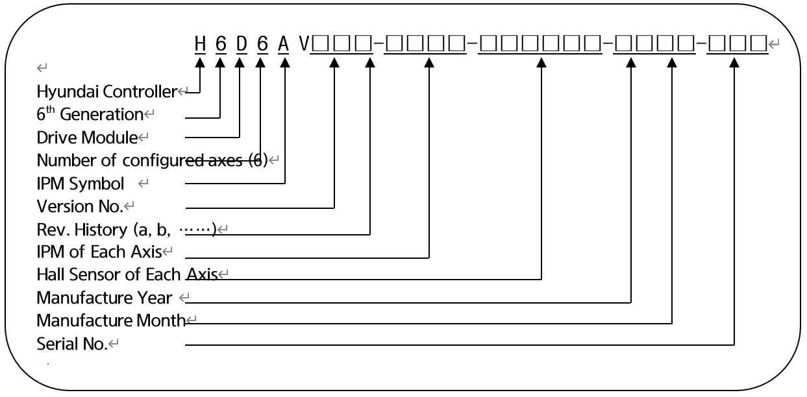

# 4.3.4.2. H6D6A (Small-Sized 6 Axes Integrated Drive Module)

The drive module performs a power amplification function that allows the current to flow to individual phases of the motor according to the current command from the servo board. The six axes integrated drive module can drive six motors at the same time and is configured as follows.

The three-phase current supplied from the power supply module is rectified through a diode module and then converted into direct current and stored in a smoothing capacitor. When the motor speed of the robot is decelerated, the electric power generated from the motor will be consumed through transistors and resistors. The relevant configuration is as follows.

Table 4-23 Configuration of H6D6A (Small-Sized 6 Axes Integrated Drive Module)

<table>
<thead>
  <tr>
    <th colspan="2">Components</th>
    <th>Components</th>
  </tr>
</thead>
<tbody>
  <tr>
    <td rowspan="6">BD653 (Power Board)</td>
    <td>Gate drive circuit</td>
    <td>Generates the IPM gate signal</td>
  </tr>
  <tr>
    <td>Gate power module</td>
    <td>Generates the gate power</td>
  </tr>
  <tr>
    <td>Current detection part</td>
    <td>Detects the current that flows through the motor</td>
  </tr>
  <tr>
    <td>Regenerative control</td>
    <td>Drives the IGBT when the PN voltage rises</td>
  </tr>
  <tr>
    <td>Error detection part</td>
    <td>Detects the overvoltage, regenerative resistor overheating, and undervoltage errors</td>
  </tr>
  <tr>
    <td>High voltage capacitor</td>
    <td>Smooths the direct current</td>
  </tr>
  <tr>
    <td rowspan="2">BD654 (Iterface Board)</td>
    <td>Sequence interlocking part</td>
    <td>Interlocks between the sequence status and the servo on signal</td>
  </tr>
  <tr>
    <td>System DIO board input and outputs </td>
    <td>Reserved IO unit inside the controller</td>
  </tr>
  <tr>
    <td rowspan="4">Other Parts</td>
    <td>Heat sink</td>
    <td>Releases the heat generated from power elements to the outside</td>
  </tr>
  <tr>
    <td>Rectification part</td>
    <td>Generates the circuit for the DC power that is supplied to the motor from the AC input main power</td>
  </tr>
  <tr>
    <td>Regenerative IGBT</td>
    <td>Performs regenerative discharge</td>
  </tr>
  <tr>
    <td>IPM</td>
    <td>A switching device</td>
  </tr>
</tbody>
</table>


The drive module differs depending on the type of the robot, so you must check the type when replacing it.


■  **Configuration of the Type Number of the Small-Sized 6 Axes Integrated Drive Module**

Table 4-24 Type Symbol of the Small-Sized 6 Axes Integrated Drive Module

<table>
<tbody>
<tr class="odd">
<td>
<strong>Category </strong>
</td>
<td>
<strong>Type symbol</strong>
</td>
</tr>
<tr class="even">
<td>
<strong>Hi6 drive module</strong>
</td>
<td>
H6D
</td>
</tr>
</tbody>
</table>

Table 4-25 Specification of the Small-Sized 6 Axes Integrated Drive Module

<table>
<thead>
  <tr>
    <th>Configuration</th>
    <th colspan="2">Classification</th>
    <th colspan="2">Application</th>
  </tr>
</thead>
<tbody>
  <tr>
    <td>IPM capacity</td>
    <td>3A</td>
    <td>3D</td>
    <td>HA006B, HH020</td>
    <td>6 axes integrated </td>
  </tr>
  <tr>
    <td>Year</td>
    <td colspan="2">00 ~ 99</td>
    <td colspan="2">Production year: 2000-2099</td>
  </tr>
  <tr>
    <td>Month</td>
    <td colspan="2">01 ~ 12</td>
    <td colspan="2">Production month: January-December</td>
  </tr>
  <tr>
    <td>Serial No.</td>
    <td colspan="2">0001 ~ 9999</td>
    <td colspan="2">Number of units produced monthly: 1~9999</td>
  </tr>
</tbody>
</table>

Table 4-26 Capacity of the Small-Sized IPM

<table>
<thead>
  <tr>
    <td rowspan="2">Small-sized</td>
    <td>A</td>
    <td>(IPM allowable current rating) 30A, (Hall sensor current rating) 4V/15A</td>
  </tr>
  <tr>
    <td>D</td>
    <td>(IPM allowable current rating) 10A, (Hall sensor current rating) 4V/5A</td>
  </tr>
</thead>
</table>

Table 4-27 Symbols of the Hall Sensors of the Small-Sized IPM

<table>
<thead>
  <tr>
    <th>Drive Model</th>
    <th>Hall sensor symbol (Specification)</th>
    <th>Full-scale current (Im)</th>
    <th>IPM specification (Allowable current rating)</th>
  </tr>
</thead>
<tbody>
  <tr>
    <td rowspan="7">Small-sized drive module</td>
    <td>3 (4V/15A)</td>
    <td>27.27Apeak</td>
    <td rowspan="2">6MBP50VAA060 (30A)</td>
  </tr>
  <tr>
    <td>4 (4V/10A)</td>
    <td>18.18Apeak</td>
  </tr>
  <tr>
    <td>5 (4V/5A)</td>
    <td>9.19Apeak</td>
    <td rowspan="2">6MBP20VAA060 (10A)</td>
  </tr>
  <tr>
    <td>6 (4V/3A)</td>
    <td>5.45Apeak</td>
  </tr>
  <tr>
    <td>7 (4V/6A)</td>
    <td>10.91Apeak</td>
    <td>6MBP50VAA060 (30A)</td>
  </tr>
  <tr>
    <td>8 (4V/2A)</td>
    <td>3.64Apeak</td>
    <td rowspan="2">6MBP20VAA060 (10A)</td>
  </tr>
  <tr>
    <td>9 (4V/1A)</td>
    <td>1.82Apeak</td>
  </tr>
</tbody>
</table>


The drive module differs depending on the type of the robot, so you must check the type when replacing it.


Figure 4.22 Parts Placement Diagram of BD653 

Table 4-28 Description of the Connectors of BD653

<table>
<tbody>
<tr class="odd">
<td>
<strong>Name</strong>
</td>
<td>
<strong>Usage</strong>
</td>
<td>
<strong>Connection of external devices</strong>
</td>
</tr>
<tr class="even">
<td>
<strong>CNPWM1~6</strong>
</td>
<td>
PWM signals and IPM error signals
</td>
<td>
Board-to-board connectors of BD654
</td>
</tr>
<tr class="odd">
<td>
<strong>CNRST</strong>
</td>
<td>
3-phase power input
</td>
<td>
CNRST for the electronic module
</td>
</tr>
<tr class="even">
<td>
<strong>CNCVT</strong>
</td>
<td>
Converter part error signal
</td>
<td>
Board-to-board connectors of BD654
</td>
</tr>
<tr class="odd">
<td>
<strong>CNDR</strong>
</td>
<td>
Regenerative power output 
</td>
<td>
Regenerative resistor
</td>
</tr>
<tr class="even">
<td>
<strong>CNTR</strong>
</td>
<td>
Regenerative resistor overheating detection
</td>
<td>
Regenerative resistor temperature sensor
</td>
</tr>
<tr class="odd">
<td>
<strong>CNM1~6</strong>
</td>
<td>
Motor drive output
</td>
<td>
CMC1
</td>
</tr>
<tr class="even">
<td>
<strong>CNPN7~8</strong>
</td>
<td>
Direct current for the drive module of the additional axis
</td>
<td>
CNPN for the drive module for an optional additional axis
</td>
</tr>
<tr class="odd">
<td>
<strong>CNFG1, CNFG4</strong>
</td>
<td>
Frame ground for motors
</td>
<td>
CMC1
</td>
</tr>
</tbody>
</table>

Table 4-29 Description of the LEDs of BD653

<table>
<tbody>
<tr class="odd">
<td>
<strong>Name</strong>
</td>
<td>
<strong>Color</strong>
</td>
<td>
<strong>Status display</strong>
</td>
</tr>
<tr class="even">
<td>
<strong>MC ON</strong>
</td>
<td>
Yellow
</td>
<td>
Will be turned on when the magnet contact is driving
</td>
</tr>
<tr class="odd">
<td>
<strong>POW</strong>
</td>
<td>
Green
</td>
<td>
Will be turned on when the control voltage of the converter part is normal
</td>
</tr>
<tr class="even">
<td>
<strong>DR</strong>
</td>
<td>
Red
</td>
<td>
Will be turned on the regenerative discharge is operating
</td>
</tr>
<tr class="odd">
<td>
<strong>PN</strong>
</td>
<td>
Red
</td>
<td>
Will be turned on when the PN voltage is higher than 42V
</td>
</tr>
<tr class="even">
<td>
<strong>RYON</strong>
</td>
<td>
Red
</td>
<td>
Will be turned off when the PN discharge operation starts
</td>
</tr>
</tbody>
</table>

Figure 4.23 Parts Placement Diagram of BD654  

Table 4-30 Description of the Connectors of BD654

<table>
<tbody>
<tr class="odd">
<td>
<strong>Name</strong>
</td>
<td>
<strong>Usage</strong>
</td>
<td>
<strong>Connection of external devices</strong>
</td>
</tr>
<tr class="even">
<td>
<strong>CNBS1~3</strong>
</td>
<td>
PWM signals and IPM error signals for 8 axes
</td>
<td>
Board-to-board connectors of BD640
</td>
</tr>
<tr class="odd">
<td>
<strong>CNPWM1~6</strong>
</td>
<td>
PWM signals and IPM error signals for individual axes
</td>
<td>
Board-to-board connectors of BD653
</td>
</tr>
<tr class="even">
<td>
<strong>CNPWM7~8</strong>
</td>
<td>
PWM signal and IPM error signal for the additional axis
</td>
<td>
CNPWM of the drive module (BD 658 or BD 659) of the additional axis
</td>
</tr>
<tr class="odd">
<td>
<strong>CNCVT</strong>
</td>
<td>
Converter part error signal
</td>
<td>
Board-to-board connectors of BD653
</td>
</tr>
<tr class="even">
<td>
<strong>TBIO</strong>
</td>
<td>
Reserved only IO terminal block
</td>
<td>
Reserved
</td>
</tr>
</tbody>
</table>

Table 4-31 Description of the LEDs of BD654

<table>
<tbody>
<tr class="odd">
<td>
<strong>Name</strong>
</td>
<td>
<strong>Color</strong>
</td>
<td>
<strong>Status Display</strong>
</td>
</tr>
<tr class="even">
<td>
<strong>MC</strong>
</td>
<td>
Yellow
</td>
<td>
Will be turned on when the magnet contact is driving
</td>
</tr>
<tr class="odd">
<td>
<strong>POW</strong>
</td>
<td>
Green
</td>
<td>
Will be turned on when the control power is normal
</td>
</tr>
</tbody>
</table>
