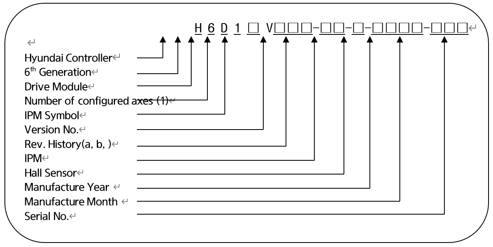

# 4.3.4.3. 선택사양 드라이브모듈 사양

■  **선택사항 드라이브모듈의 형번 구성**

표 4-32 선택사양 드라이브모듈의 형식 기호

<table>
<thead>
  <tr>
    <th>구분</th>
    <th>형식 기호</th>
  </tr>
</thead>
<tbody>
  <tr>
    <td>Hi6 1축 드라이브모듈</td>
    <td>H6D1</td>
  </tr>
</tbody>
</table>

표 4-33 선택사양 드라이브모듈의 IPM 기호

<table>
<thead>
  <tr>
    <th>Drive Model</th>
    <th>IPM 기호</th>
    <th>IPM 사양</th>
  </tr>
</thead>
<tbody>
  <tr>
    <td rowspan="6">부가축 드라이브모듈</td>
    <td>X</td>
    <td>(IPM 전류정격) 100A</td>
  </tr>
  <tr>
    <td>Y</td>
    <td>(IPM 전류정격) 75A</td>
  <tr>
    <td>Z</td>
    <td>(IPM 전류정격) 50A</td>
  </tr>
</tbody>
</table>

표 4-34 션택사양 드라이브모듈의 홀센서(Hall Sensor) 기호

<table>
<thead>
  <tr>
    <th>Drive Model</th>
    <th>Hall Sensor기호(사양)</th>
    <th>Full Scale 전류(Im)</th>
    <th>IPM 사양 (정격 전류)</th>
  </tr>
</thead>
<tbody>
  <tr>
    <td rowspan="6">부가축 드라이브모듈</td>
   </tr>
  <tr>
    <td>1 (4V/50A)</td>
    <td>93.75Apeak</td>
    <td rowspan="5">PM100CG1APL065 202G (100A) PM75CG1APL065 202G (75A) PM50CG1APL065 202G (50A)</td>
  </tr>
  <tr>
    <td>2 (4V/25A)</td>
    <td>46.87Apeak</td>
  </tr>
  <tr>
    <td>3 (4V/15A)</td>
    <td>28.12Apeak</td>
  </tr>
  <tr>
    <td>4 (4V/10A)</td>
    <td>18.75Apeak</td>
  </tr>
  <tr>
    <td>5 (4V/5A)</td>
    <td>9.37Apeak</td>
  </tr>
</tbody>
</table>
