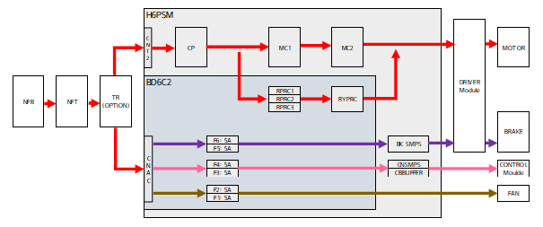

# 4.3.5.1. H6PSM 和电源分配板 (BD6C2)

H6PSM（Hi6-N 控制器电源模块）模块负责控制器供电的打开、关闭和分配。下图显示了具有多种连接器和保险丝的电气模块的内部和外部。

_외부.png)

图 4.26 H6PSM（Hi6-N 控制器电源模块）外部

下图显示了与电机电源的 3 相 AC 电源的打开和关闭、制动电源的生成以及风扇驱动相关的 AC 控制电源的电源系统图。图中的电路图还显示了电源模块的直流电源的 SMPS 电源等电源分配情况。每个电源连接了断路器（CP）或保险丝，以保护各个电路免受过电流的影响。

图 4.27 Hi6-N 控制器的电源系统  

表 4-39 电子模块保险丝的类型和用途 

<table>
<thead>
  <tr>
    <th>名称</th>
    <th>用途</th>
    <th>规格</th>
  </tr>
</thead>
<tbody>
  <tr>
    <td>F1, F2</td>
    <td>冷却风扇电源的过电流保护保险丝 (AC220V)</td>
    <td>AC220V 5A</td>
  </tr>
  <tr>
    <td>F3, F4</td>
    <td>CMSMPS 电源的过电流保护保险丝 (AC220V)</td>
    <td>AC220V 5A</td>
  </tr>
  <tr>
    <td>F5, F6</td>
    <td>BKSMPS 电源的过电流保护保险丝 (AC220V)</td>
    <td>AC220V 5A</td>
  </tr>
</tbody>
</table>