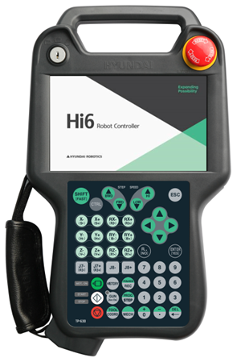

# 4.3.6.1. 概述

教导挂件 (TP630) 通过以太网与控制器的主模块 (H6COM-T) 进行通信，并允许用户直接操作以下功能。

* 监控 : 作业程序 / 各轴的数据 / 输入和输出信号 / 机器人状态等。

* 日志管理 : 系统版本，运行时间，错误日志，停止日志等。

* 文件管理 : 版本和教导程序的上下传

* 各种变量的设置 : 用户环境 / 控制 / 机器人 / 应用 / 自动整数等。

* 机器人教学 : Jog 和教导程序注册

* 机器人操作 : 电机开启 / 启动 / 停止 / 模式设置

教导挂件还配备了三段启用开关和紧急停止开关，以确保用户安全。
此外，教导挂件底部的橡胶盖下安装了一个 USB A 型连接器，允许用户使用 USB 存储棒上传/下载必要的文件，例如数据和教学程序，以及多种类型板的版本。

Figure 4.29 教导挂件 TP630 的外观