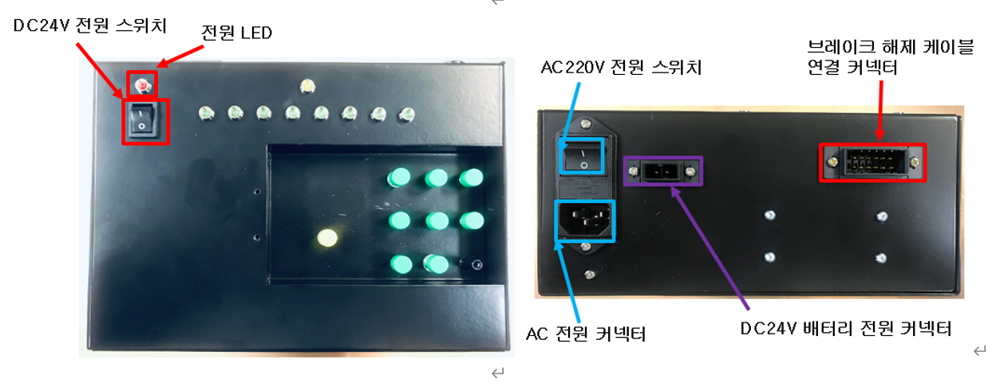

# 5.2.2. 전원 및 커넥터

브레이크 해제 유닛의 전원 및 커넥터 배치는 다음 그림5.4와 같으며 각각에 대한 용도 및 접속장치는 표 5-5와 같습니다.

-주의,경고.png  )

표 5-5 브레이크 해제 유닛 커넥터의 종류 및 용도

<table>
<thead>
  <tr>
    <th>명 칭</th>
    <th>용      도</th>
    <th>외부연결장치</th>
  </tr>
</thead>
<tbody>
  <tr>
    <td>AC220V 전원 커넥터 및 스위치</td>
    <td>AC 전원 인가</td>
    <td>100V AC ~ 240V AC 단상</td>
  </tr>
  <tr>
    <td>브레이크 해제 케이블 연결 커넥터</td>
    <td>브레이크 해제유닛과 제어기 연결</td>
    <td>BD640보드 CNB1, CNB7, CNB8</td>
  </tr>
  <tr>
    <td>DC24V 배터리 전원 커넥터</td>
    <td>휴대용 24V 배터리 전원 연결</td>
    <td>휴대용 24V 배터리</td>
  </tr>
  <tr>
    <td>DC24V전원 스위치</td>
    <td>브레이크 해제유닛 구동 ON/OFF</td>
    <td>없음</td>
  </tr>
</tbody>
</table>
