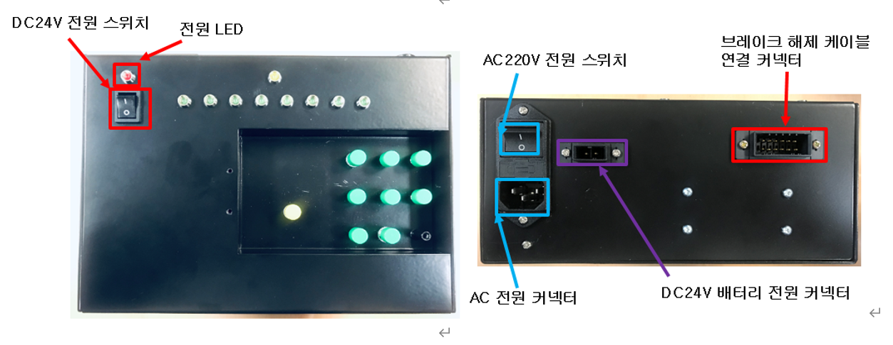

# 5.2.3. 电源与连接器

刹车释放单元的电源和连接器的放置如下面的图5.4所示，它们的各自用途和连接设备如下面的表5-5所示。


- 使用刹车释放单元时，请遵循以下程序。
1. 关闭 AC220V 电源开关，并检查 DC24V 电源开关是否关闭。
2. 将交流电源线连接到交流电源连接器。
3. 打开 AC220V 电源开关。
4. 打开 DC24V 电源开关。

- 当刹车释放单元的使用完成后，请遵循以下程序。
1. 关闭 DC24V 电源开关。
2. 关闭 AC220V 电源开关。
4. 断开交流电源线。

- 请勿同时使用 AC220V 电源与 DC24V 电池电源。



本公司（或制造商）将对因未遵守上述“注意事项”而发生的任何事故不负责。


图5.4 刹车释放单元的开关和连接器  

表5-5 刹车释放单元的连接器类型和用途

<table>
<thead>
  <tr>
    <th>名称</th>
    <th>用途</th>
    <th>外部设备的连接</th>
  </tr>
</thead>
<tbody>
  <tr>
    <td>AC 220V 电源连接器和开关</td>
    <td>交流电源的应用</td>
    <td>100V AC~240V AC单相</td>
  </tr>
  <tr>
    <td>刹车释放电缆连接连接器</td>
    <td>刹车释放单元与控制器的连接</td>
    <td>BD640的CNB1、CNB7和CNB8</td>
  </tr>
  <tr>
    <td>DC24V电池电源连接器</td>
    <td>便携式24V电池电源的连接</td>
    <td>便携式24V电池</td>
  </tr>
  <tr>
    <td>DC24V电源开关</td>
    <td>刹车释放单元驱动的开/关</td>
    <td>无</td>
  </tr>
</tbody>
</table>