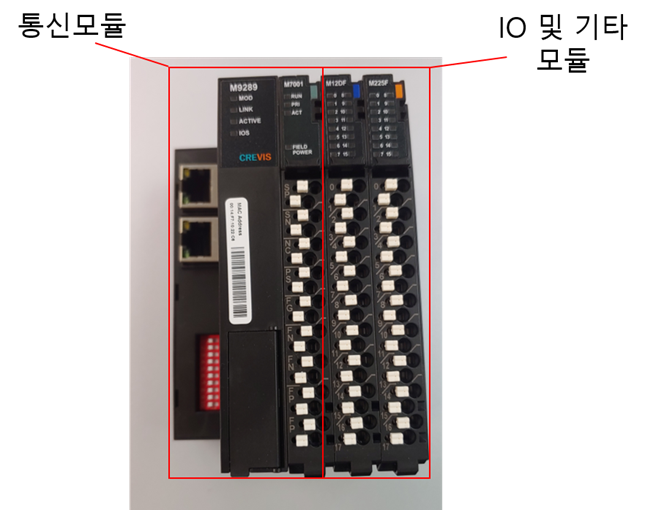

# 5.3.1. 概述

要在 Hi6 控制器中使用通用 IO 信号，您需要商业远程 IO。基本上，可以通过将用户选择的“IO 模块”连接到一个“通信模块”来使用商业远程 IO。下面介绍的模块是 Crevis 的商业远程 IO 模块，您也可以购买并使用其他公司的商业远程 IO。有关如何使用每个模块的详细信息，您需要向您购买的 IO 模块的公司咨询。


要使用商业远程 IO，必须支持现场总线通信。因此，您应参照上述的“5.1 PCI 通信卡”共同配置 PCI 通信卡。


图 5.5 商业远程 IO 配置示例