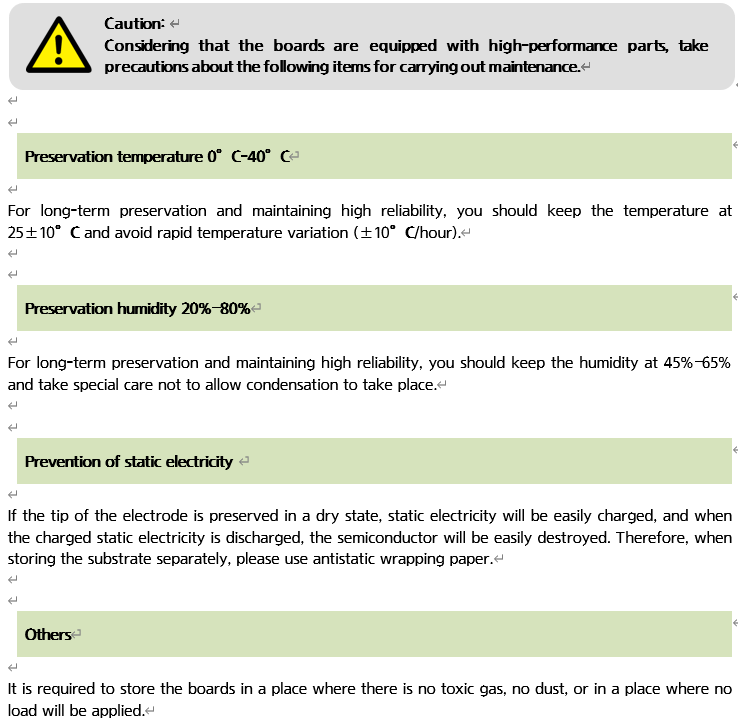

# 6.7. 维护零件 

各个零件的特性如下所述。 

**A类维护零件**


这些是日常维护和检查中需要准备的重要零件。


为了保持正常操作，A-2类和A-3类零件是最基本的必要零件，每组至少应准备一套。

表6-4 A类维护零件的检查 

<table>
<thead>
  <tr>
    <th>类型</th>
    <th>内容</th>
    <th>备注（参考）</th>
  </tr>
</thead>
<tbody>
  <tr>
    <td>A-1类维护零件</td>
    <td>标准零件的备件</td>
    <td></td>
  </tr>
  <tr>
    <td>A-2类维护零件</td>
    <td>重要备份零件</td>
    <td></td>
  </tr>
  <tr>
    <td>A-3类维护零件</td>
    <td>定期更换零件</td>
    <td></td>
  </tr>
</tbody>
</table>

表6-5 A-1类维护零件（标准零件的备件） 

<table>
<thead>
  <tr>
    <th>编号</th>
    <th>零件名称</th>
    <th>类型</th>
    <th>制造商</th>
    <th>数量（EA）</th>
    <th>备注</th>
  </tr>
</thead>
<tbody>
  <tr>
    <td>1</td>
    <td>保险丝（F1,F2）</td>
    <td>0218005</td>
    <td>Littlefuse</td>
    <td>2</td>
    <td>BD6C2</td>
  </tr>
  <tr>
    <td>2</td>
    <td>保险丝（F3,F4）</td>
    <td>0218005</td>
    <td>Littlefuse</td>
    <td>2</td>
    <td>BD6C2</td>
  </tr>
  <tr>
    <td>3</td>
    <td>保险丝（F5,F6）</td>
    <td>0218005</td>
    <td>Littlefuse</td>
    <td>2</td>
    <td>BD6C2</td>
  </tr>
</tbody>
</table>

表6-6 A-2类维护零件（重要备份零件） 

<table>
<thead>
  <tr>
    <th>编号</th>
    <th>零件名称</th>
    <th>类型</th>
    <th>制造商</th>
    <th>数量（EA）</th>
    <th>备注</th>
  </tr>
</thead>
<tbody>
  <tr>
    <td>1</td>
    <td>电动机驱动</td>
    <td>H6D6X H6D6A</td>
    <td>Hyundai Robotics</td>
    <td>1</td>
    <td>大型机器人 中型 小型机器人</td>
  </tr>
  <tr>
    <td>2</td>
    <td>主控制模块</td>
    <td>H6COM</td>
    <td>Hyundai Robotics</td>
    <td>1</td>
    <td></td>
  </tr>
  <tr>
    <td>3</td>
    <td>教导手柄</td>
    <td>TP600</td>
    <td>Hyundai Robotics</td>
    <td>1</td>
    <td></td>
  </tr>
  <tr>
    <td>4</td>
    <td>电源模块</td>
    <td>H6PSM30 H6PSM15</td>
    <td>Hyundai Robotics</td>
    <td>1</td>
    <td>大型机器人 中型机器人 小型机器人</td>
  </tr>
  <tr>
    <td rowspan="3">5</td>
    <td rowspan="3">电路板</td>
    <td>BD640</td>
    <td>Hyundai Robotics</td>
    <td>1</td>
    <td>伺服板</td>
  </tr>
  <tr>
    <td>BD632</td>
    <td>Hyundai Robotics</td>
    <td>1</td>
    <td>安全IO板</td>
  </tr>
  
</tbody>
</table>

表6-7 A-3类维护零件（定期更换零件） 

<table>
<tbody>
<tr class="odd">
<td>
<strong>编号</strong>
</td>
<td>
<strong>零件名称</strong>
</td>
<td>
<strong>类型</strong>
</td>
<td>
<strong>制造商</strong>
</td>
<td>
<strong>数量（EA）</strong>
</td>
<td>
<strong>备注</strong>
</td>
</tr>
<tr class="even">
<td>
1
</td>
<td>
电池（3.6V AA规格）
</td>
<td>
ER6V-T1
</td>
<td>
TOSHIBA (日本)
</td>
<td>
1
</td>
<td>
每两年更换一次
</td>
</tr>
</tbody>
</table>

**B类维护零件**


这些是购买多个单元时需要准备的维护零件。


表6-8 B类维护零件 

<table>
<tbody>
<tr class="odd">
<td>
<strong>类型</strong>
</td>
<td>
<strong>内容</strong>
</td>
<td>
<strong>备注（参考）</strong>
</td>
</tr>
<tr class="even">
<td>
B-1类维护零件
</td>
<td>
应从Hyundai Robotics购买的零件
</td>
<td></td>
</tr>
<tr class="odd">
<td>
B-2类维护零件
</td>
<td>
可以直接从零件制造商购买的零件
</td>
<td></td>
</tr>
</tbody>
</table>

表6-9 B-1类维护零件（应从Hyundai Robotics购买的零件）

<table>
<thead>
  <tr>
    <th>编号</th>
    <th>零件名称</th>
    <th>类型</th>
    <th>制造商</th>
    <th>数量（EA）</th>
    <th>备注</th>
  </tr>
</thead>
<tbody>
  <tr>
    <td rowspan="3">1</td>
    <td rowspan="3">线束</td>
    <td>CMC1</td>
    <td>Hyundai Robotics</td>
    <td>1</td>
    <td>大型/中型/小型</td>
  </tr>
  <tr>
    <td>CMC2</td>
    <td>Hyundai Robotics</td>
    <td>1</td>
    <td>大型/中型</td>
  </tr>
  <tr>
    <td>CEC1</td>
    <td>Hyundai Robotics</td>
    <td>1</td>
    <td>大型/中型/小型</td>
  </tr>
</tbody>
</table>

表6-10 B-2类维护零件（可以直接从零件制造商购买的零件）

<table>
<tbody>
<tr class="odd">
<td>
<strong>编号</strong>
</td>
<td>
<strong>零件名称</strong>
</td>
<td>
<strong>类型</strong>
</td>
<td>
<strong>制造商</strong>
</td>
<td>
<strong>数量（EA）</strong>
</td>
<td>
<strong>备注</strong>
</td>
</tr>
<tr class="even">
<td>
<strong>1</strong>
</td>
<td>
无保险断路器（NFB）
</td>
<td>
-
</td>
<td>
-
</td>
<td>
1
</td>
<td></td>
</tr>
<tr class="odd">
<td>
<strong>2</strong>
</td>
<td>
磁性接触器（MC1, MC2）
</td>
<td>
-
</td>
<td>
-
</td>
<td>
2
</td>
<td></td>
</tr>
<tr class="even">
<td>
<strong>3</strong>
</td>
<td>
电路保护器（CP1）
</td>
<td>
-
</td>
<td>
-
</td>
<td>
1
</td>
<td></td>
</tr>
</tbody>
</table>

